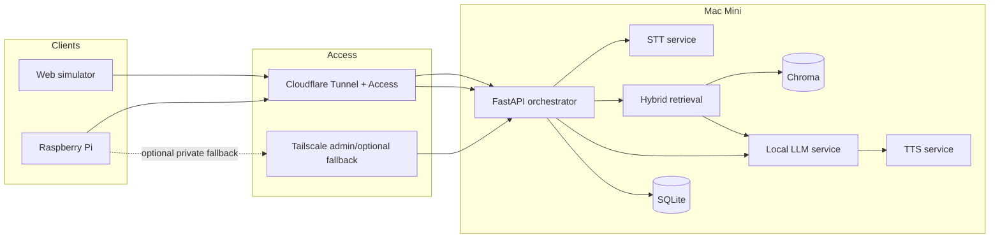

# KaKi-Talkie

KaKi-Talkie is a voice-first assistance prototype designed to help seniors discover and understand support available to them without requiring them to navigate a conventional app or website.

The user deliberately activates the device, asks a question naturally, and receives a grounded spoken response based on allowlisted official information. A concise answer can also be displayed and printed as an English thermal-paper slip.

The MVP is built **software-first**. A browser simulator exercises the same backend contract as the Raspberry Pi device so the core experience can be developed and demonstrated before physical integration is complete.

## Project status

**WP1 is closed. WP2 is the current build package.**

The protected canned simulator/backend contract has passed the WP1 owner gate. The next build step replaces canned inference with the real local English voice loop.

## Authoritative documents

Use each document for one job:

```text
+-------------------------------------------------+----------------------------------------------+
| Document                                        | Purpose                                      |
+-------------------------------------------------+----------------------------------------------+
| docs/04-prototype/design.md                     | Architecture source of truth                 |
| docs/04-prototype/execution-plan.md             | Scope, IU boundaries and acceptance gates   |
| docs/04-prototype/wp-validation-runbook.md      | Install, setup, run, test and teardown       |
| AGENTS.md                                       | Codex safeguards and code contract           |
+-------------------------------------------------+----------------------------------------------+
```

The validation runbook is the **single operational source of truth**. Do not reconstruct WP setup or testing by combining commands from several READMEs.

## Architecture



> **The Mac Mini does the thinking. Clients stay deliberately simple.**

The browser simulator and Raspberry Pi consume the same backend contract. Model implementations remain replaceable behind service interfaces.

## Development model

```text
+------------------------+--------------------------------------------------+
| Environment            | Role                                             |
+------------------------+--------------------------------------------------+
| Windows gaming desktop | Codex, Git worktrees, coding and Tier A tests    |
| Mac Mini               | Runtime, local models and Tier B validation      |
| Raspberry Pi           | Thin client and Tier C hardware validation       |
+------------------------+--------------------------------------------------+
```

Codex runs only on the Windows gaming desktop. Mac Mini and Raspberry Pi preparation is performed manually using the validation runbook.

The normal implementation-unit rhythm is deliberately simple:

```text
Prepare WPn.m
-> review the runbook + any real product decision
-> prepare the Mac/Pi in parallel where needed
-> Implement WPn.m
-> review diff/tests
-> follow the runbook owner check
-> commit/merge/push manually
```

Detailed worktree setup/cleanup commands live in the validation runbook so there is only one maintained operational guide.

## Repository ownership

```text
kaki-talkie/
|-- docs/                 Product, design, runbook, test evidence and ADRs
|-- apps/web/             Browser simulator and protected test surfaces
|-- backend/              FastAPI API, orchestration, state and actions
|-- services/             Swappable STT, LLM and TTS adapters
|-- rag/                  Ingestion, provenance, retrieval and Chroma
|-- agent/                DSPy behaviour and regression data when adopted
|-- device/               Thin Raspberry Pi client
|-- infra/                Cloudflare, Tailscale and host configuration
|-- hardware/             BOM, wiring, enclosure and build evidence
|-- tests/                End-to-end, latency and consent-cleared fixtures
|-- scripts/              Development and operational helper scripts
+-- .github/              CI and repository automation
```

Do not create empty packages merely because they appear in the target design tree.

## Current model strategy

- **STT baseline:** Whisper large-v3-turbo through `whisper.cpp`
- **STT challenger:** MERaLiON-3-3B-ASR
- **LLM baseline:** small quantised local Qwen-class model through MLX-LM
- **LLM challenger:** SEA-LION family where measurements justify it
- **English TTS baseline:** macOS `say`
- **TTS target/challenger:** OmniVoice family where quality/runtime justify it
- **Vector store:** Chroma behind a retrieval interface

Model bake-offs happen after the basic end-to-end flow works. Challengers are experiments, not schedule blockers.

## Browser simulator scope

The simulator is primarily a development and acceptance-test surface, not the final product UI.

- Chrome is the primary MVP acceptance browser.
- Safari is a best-effort additional compatibility check and is **not a gating MVP requirement**.
- Phone access through the protected HTTPS hostname is still useful for validating touch/microphone behaviour.

## Data and privacy

- Raw user audio is deleted after transcription by default.
- Only consent-cleared audio may be placed under repository test fixtures.
- Runtime SQLite and Chroma databases are not committed.
- Generated/downloaded corpus snapshots and processed corpus output belong under `KAKI_DATA_ROOT`, outside Git.
- A small, deliberate, non-sensitive copy may be committed only when it is intentionally curated as deterministic test evidence/fixture.
- The LLM does not invent provenance URLs or source dates.

## Handoff and external actions

The backend keeps handoff and calendar actions behind ports/adapters.

Google Calendar remains the baseline permitted calendar integration for the current plan.

The exact kaki handoff channel is **not locked yet**. Telegram remains a candidate adapter that can be selected at WP4, but the project must not build or require Telegram before that decision is made.

## Code conventions

The detailed coding contract is in `AGENTS.md`.

Key points:

- module-level configuration is kept visible; local variables are declared near use;
- clear functions and names are preferred over dense expressions;
- Python modules/classes/public methods have useful docstrings;
- human-operated Python scripts provide `--help`;
- top-of-file change histories are a practical, newest-first convention, not a gate;
- inline version markers are optional; no history-enforcement tooling is maintained;
- DSPy is introduced only when the execution plan reaches the planned migration.

## CI and validation

Hosted/Tier A tests should stay fast and deterministic.

Model-heavy Mac Mini tests and physical-device tests belong to Tier B/C owner validation and are documented in the runbook.

A green Codex test run does not replace the owner validation level defined by the execution plan.

## Scope boundaries

The MVP intentionally excludes:

- Singpass authentication or transactions;
- credential collection;
- an always-on microphone;
- multilingual thermal printing;
- unrestricted autonomous web browsing;
- health-record access;
- production-scale evaluation;
- caregiver application/pairing UI.

The priority is a trustworthy, testable, grounded interaction rather than maximum feature coverage.

## Licence

Code and project documentation are licensed under the repository `LICENSE`. Third-party models, datasets, libraries and downloaded artefacts remain subject to their own licences.
