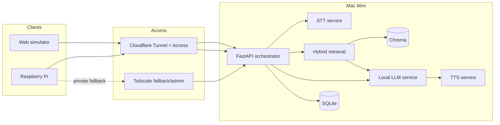

# KaKi-Talkie

KaKi-Talkie is a voice-first assistance prototype designed to help seniors discover and understand support available to them without requiring them to navigate a conventional app or website.

The user deliberately activates the device, asks a question naturally, and receives a grounded spoken response based on allowlisted official information. A concise answer can also be displayed and printed as an English thermal-paper slip.

The MVP is being built **software-first**. A browser simulator exercises the same backend contract as the Raspberry Pi device, allowing the core experience to be developed and demonstrated even before the physical hardware is complete.

## Project status

**MVP architecture locked. Implementation starting.**

The current architecture baseline is documented in:

- `docs/00-genesis.md` - original project decisions and product requirements
- `docs/04-prototype/design.md` - authoritative MVP backend and simulator design

The first implementation milestone is a working browser-to-backend vertical slice with canned responses, followed by STT, local LLM, TTS and grounded retrieval.

## MVP experience

A typical supported turn is:

1. The user deliberately activates the device or simulator.
2. The user speaks in English, Singapore English/Singlish, Malay, or Hokkien.
3. Speech is transcribed by the backend.
4. The request is classified and routed.
5. Relevant evidence is retrieved from allowlisted official sources.
6. A local LLM produces a concise grounded response.
7. The response is returned as:
   - spoken audio in the conversational language where supported;
   - concise display text;
   - concise English text for printing.
8. Unsupported questions are refused rather than guessed.

KaKi-Talkie provides **information guidance only** for services such as Singpass. It does not authenticate to Singpass, request credentials, perform transactions on behalf of the user, or require passwords or OTPs.

## Architecture



The governing architecture principle is:

> **The Mac Mini does the thinking. Clients stay deliberately simple.**

The browser simulator and Raspberry Pi consume the same backend contract. Model implementations remain replaceable behind service interfaces.

## Initial model strategy

The MVP deliberately treats model selection as a measured implementation choice rather than a permanent architectural dependency.

- **STT baseline:** Whisper large-v3-turbo through `whisper.cpp`
- **STT challenger:** MERaLiON-3-3B-ASR
- **LLM baseline:** small quantised local Qwen-class model
- **LLM challenger:** Qwen-SEA-LION-v4.5-27B-IT or another suitable SEA-LION model
- **TTS baseline:** fast English TTS for the first vertical slice
- **TTS target:** OmniVoice family, including Singapore-language variants where quality is acceptable
- **Vector store:** Chroma behind a retrieval interface

Model bake-offs happen after the basic end-to-end flow works. Evaluation must improve the build, not delay it.

## Retrieval strategy

KaKi-Talkie does not use an unrestricted open-web agent for its core answers.

The retrieval layer uses:

- allowlisted official sources;
- dated source snapshots;
- structured provenance metadata;
- hybrid lexical and dense retrieval;
- both the original transcript and a normalised search query;
- a separate allowlisted live-lookup path for information that becomes stale quickly.

Static guidance and volatile information are intentionally handled differently.

The application derives source metadata from retrieval results. The LLM is not trusted to invent URLs, dates, or citations.

## Repository layout

The full target structure is documented in `docs/04-prototype/design.md`. The major ownership boundaries are:

```text
kaki-talkie/
|-- README.md
|-- CHANGELOG.md
|-- LICENSE
|-- .gitignore
|-- .env.example
|
|-- docs/                 Product, design, test evidence and ADRs
|-- apps/web/             Browser simulator and later web surfaces
|-- backend/              FastAPI API, orchestration, state and actions
|-- services/             Swappable STT, LLM and TTS adapters
|-- rag/                  Ingestion, provenance, retrieval and Chroma
|-- agent/                DSPy behaviour and growing regression data
|-- device/               Thin Raspberry Pi client
|-- infra/                Cloudflare, Tailscale and host configuration
|-- hardware/             BOM, wiring, enclosure and build evidence
|-- tests/                End-to-end, latency and consent-cleared fixtures
|-- scripts/              Development and operational helper scripts
+-- .github/              CI, issue templates and pull-request templates
```

Do not create empty packages simply because they appear in the target tree. Directories should be introduced when the first implementation needs them.

## Build sequence

The MVP is intentionally built as a series of working vertical slices.

1. **Simulator + canned backend**
   - FastAPI returns the agreed response contract.
   - Browser records and sends audio.
   - Simulator displays states and renders an English receipt.

2. **Speech-to-text**
   - Whisper transcribes recorded audio.
   - Per-stage timing is captured.

3. **Complete local voice loop**
   - Small local LLM produces a response.
   - English TTS returns playable audio.

4. **Grounded retrieval**
   - Initial official pages are ingested.
   - Hybrid retrieval returns evidence with application-derived provenance.

5. **State and deterministic actions**
   - Refusal, repeat and print-previous work.
   - SQLite stores sessions, turns and cases.

6. **Singapore-language paths**
   - Malay is exercised.
   - A small regression set grows from real failures.

7. **Model bake-offs**
   - MERaLiON-3 is compared with Whisper.
   - SEA-LION is compared with the smaller local LLM.
   - Challengers are promoted only when measurements justify the trade-off.

8. **Volatile information**
   - Selected current information, such as community-centre events, uses allowlisted live retrieval.

9. **Physical client**
   - The Raspberry Pi consumes the same backend contract.
   - Button, audio, LED and printer behaviour are tested as hardware concerns.

DSPy can be introduced once the grounded vertical slice works. It must not block the early build.

## Successful backend MVP

The software MVP is complete when a colleague can use the protected browser simulator to:

- record a natural spoken question;
- obtain a useful transcription;
- retrieve evidence from an allowlisted official source;
- receive a concise grounded response;
- hear the response spoken;
- see a concise display version;
- request an English printed-slip representation;
- receive a refusal for an unsupported question; and
- later repeat the same flow through the Raspberry Pi without changing the backend contract.

This makes the simulator a software twin of the interaction and backend contract, not a claim that the physical hardware itself has been validated.

## Development conventions

### Python

- Declare variables explicitly.
- Avoid lambda functions unless they are genuinely the clearest option.
- Keep model/vendor-specific code behind adapters.
- Keep business and orchestration logic out of the Raspberry Pi client.

### Code change history

Every code file must begin with the project change-log block:

```python
# v1.1 | 31-Aug-2026 | Description of change
# v1.0 | 31-Aug-2026 | First version
```

Only lines changed for a version receive the matching inline version marker, for example:

```python
MAX_RECORD_SECONDS = 15  #v1.1
```

Do not use `#changed` or timestamp-based inline change comments.

### Secrets

Never commit credentials, device tokens, API keys, Cloudflare credentials, Tailscale credentials, model-provider keys, or service-account files.

Use `.env.example` to document required environment variable names with blank or safe example values.

### Data and privacy

- Raw user audio is deleted after transcription by default.
- Only consent-cleared audio may be placed under repository test fixtures.
- Runtime SQLite and Chroma databases are local artefacts and are not committed.
- Dated allowlisted source snapshots may be committed as provenance evidence when their content and size are appropriate for Git.

## CI philosophy

CI should remain fast enough that contributors actually use it.

Initial CI should cover:

1. Python linting/formatting;
2. unit tests;
3. simulator build;
4. backend contract tests.

Model-heavy local inference should not be made a mandatory hosted-CI step unless an appropriate runner is available.

## Scope boundaries

The MVP intentionally does **not** include:

- Singpass authentication or transactions;
- credential collection;
- an always-on microphone;
- multilingual thermal printing;
- unrestricted autonomous web browsing;
- health-record access;
- production-scale evaluation;
- broad multi-user household identification.

The priority is a trustworthy, testable, grounded interaction rather than maximum feature coverage.

## Contributing

This is currently an MVP project. Keep changes small, traceable and aligned with the locked design.

Before adding a new model, framework or external service, check whether it changes an architecture decision or simply implements an existing port.

Significant architecture changes should be recorded under `docs/decisions/` as an Architecture Decision Record (ADR).

## Licence

A repository licence should cover code and documentation created by the KaKi-Talkie project only. Third-party models, datasets, libraries and downloaded artefacts remain subject to their own licences.

See the repository `LICENSE` file once the project licence is adopted.
