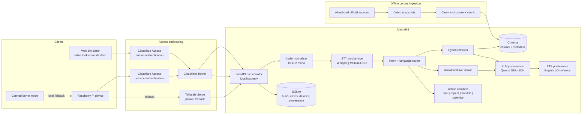
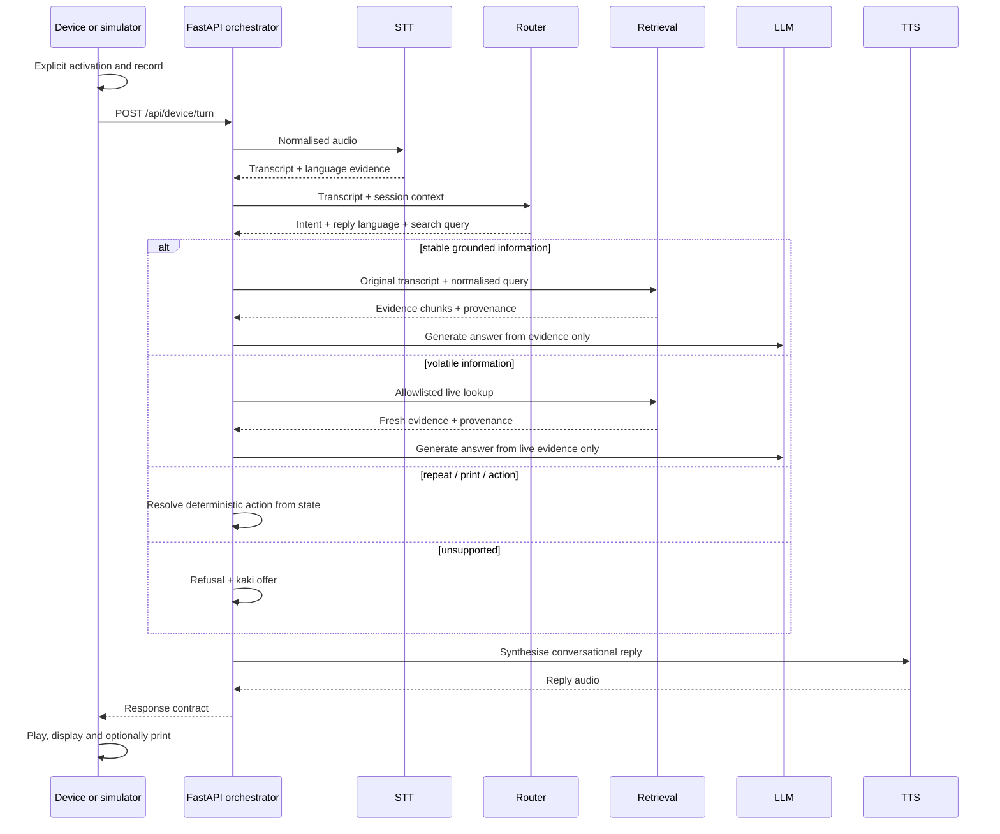
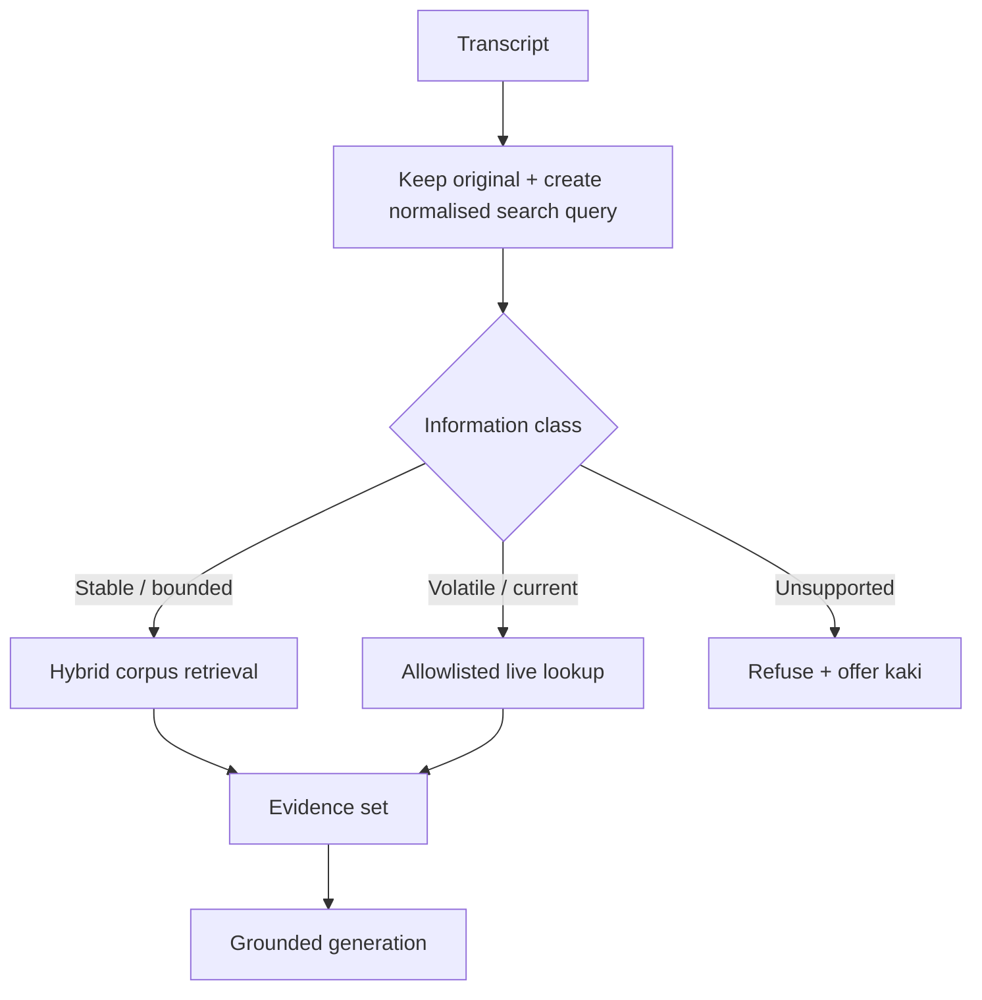

# KaKi-Talkie MVP backend design

**Final locked design for the voice pipeline, grounded retrieval, web simulator, and deployment architecture**

Version 1.1 | 02-Sep-2026 | SGLN Group 10

Suggested repository location: `docs/04-prototype/design.md`

This document extends the KaKi-Talkie Genesis document and supersedes backend design v1.0 and all earlier backend-design drafts. **This document is the single authoritative source of truth for the MVP build.** Execution plans, setup procedures, AGENTS.md and implementation code must conform to it. If another project document conflicts with this design, this design wins and the other document must be corrected.

Nothing here is implementation code. It records the architecture, locked decisions, interfaces, model candidates, delivery sequence, and known constraints for the MVP.

---

## 1. What this design must deliver

KaKi-Talkie must support four core behaviours:

1. Sabariah deliberately activates the device and speaks in English, Singapore English/Singlish, Malay, or Hokkien.
2. The backend converts speech to text, determines what she is asking, retrieves relevant information from allowlisted official sources, and produces a grounded answer.
3. The answer returns in two user-facing forms:
   - a concise display response;
   - spoken audio in the user's conversational language where supported.
4. When printing is requested or enabled by device policy, the device prints a concise English slip.

The first delivery milestone is a browser simulator hosted under `lookieman.dev`. It must exercise the same backend contract as the physical Raspberry Pi so the software can be built, tested, demonstrated, and iterated before the hardware is complete.

The simulator validates the backend and interaction contract. It does not claim to validate GPIO, USB audio, printer power, physical acoustics, or other hardware-specific behaviour.

---

## 2. Locked design decisions

```text
+--------------------------+----------------------------------------------------------+
| Area                     | Locked MVP decision                                      |
+--------------------------+----------------------------------------------------------+
| Backend host             | Mac Mini M4 Pro, 48 GB unified memory, behind           |
|                          | Cloudflare Tunnel.                                        |
| Public hostname          | talkie.lookieman.dev                                     |
| Backend framework        | FastAPI orchestrator.                                    |
| Runtime shape            | One logical backend, with STT/LLM/TTS behind separate   |
|                          | local service/process boundaries.                        |
| Physical client          | Raspberry Pi remains a thin client.                     |
| Web simulator            | Calls the same backend contract as the Pi.               |
| STT baseline             | Whisper large-v3-turbo through whisper.cpp.             |
| STT challenger           | MERaLiON-3-3B-ASR, benchmarked for SG English, Malay,   |
|                          | Hokkien and code-switching if local runtime is viable.    |
| LLM baseline             | Small local Qwen-class model, approximately 8B,          |
|                          | quantised, served locally through MLX-LM.                |
| LLM challenger           | Qwen-SEA-LION-v4.5-27B-IT or another SEA-LION model,    |
|                          | only if measured quality justifies latency.               |
| TTS baseline             | macOS `say` as the fast English vertical-slice baseline. |
| TTS target               | OmniVoice family for English/Malay and MERaLiON          |
|                          | OmniVoice Hokkien where quality is acceptable.            |
| RAG store                | Chroma behind a retriever interface.                     |
| Retrieval                | Hybrid retrieval over original + normalised query.       |
| Dynamic information      | Separate allowlisted live lookup path, not stale RAG.    |
| Prompting                | Start simple; DSPy modules introduced without blocking   |
|                          | the first working build.                                  |
| State                    | SQLite for devices, turns, cases and provenance.         |
| Printed language         | English only for MVP.                                    |
| Raw audio retention      | Deleted after transcription by default.                  |
| Evaluation               | Evaluation-light: instrument from day one; grow a small  |
|                          | regression set during development.                        |
| Admin access             | Tailscale.                                                |
| Private backend fallback | Optional Tailscale Serve path; not an MVP delivery gate. |
+--------------------------+----------------------------------------------------------+
```

The governing principle remains:

> The Mac Mini does the thinking. Clients stay deliberately simple.

---

## 3. System architecture



### 3.1 One backend does not mean one model process

To the Pi and simulator, KaKi-Talkie exposes one backend contract.

Internally, FastAPI is the orchestrator rather than the owner of every model runtime. STT, LLM and TTS sit behind ports/interfaces and may run as separate local processes. This provides:

- independent restart and failure boundaries;
- freedom to use different runtimes for Whisper, MERaLiON, Ollama/MLX and OmniVoice;
- easier model bake-offs;
- less risk of dependency conflicts;
- no change to the Pi when a model implementation changes.

The first implementation may still be operationally simple. The important constraint is that service boundaries exist in the design even if some begin in-process during the earliest prototype.

---

## 4. Interaction model

### 4.1 Activation and recording

The physical MVP retains deliberate physical activation. The microphone must not be always listening.

The initial hardware interaction remains press-and-hold:

1. Button down: listening starts and the listening state is shown.
2. User speaks while holding the button.
3. Button release: recording stops and the request is sent.
4. Recording is capped at 15 seconds.

The design does **not** depend on a spoken greeting being played while recording. Acoustic echo cancellation must not be required for interaction correctness.

For the first build, use a short local acknowledgement chime or tone when listening begins. A spoken greeting can be tested later as an interaction experiment.

An alternative interaction may be tested during user sessions:

`press once -> greeting -> listen -> VAD/silence ends recording`

Adopt it only if it is clearly easier for seniors than hold-to-talk.

### 4.2 Turn sequence



---

## 5. Request and response contract

### 5.1 POST /api/device/turn

The request is multipart form data containing:

```text
+----------------+----------------------------------------------------------+
| Field          | Purpose                                                  |
+----------------+----------------------------------------------------------+
| audio          | Recorded utterance.                                      |
| device_id      | Identifies the physical or simulated device.             |
| session_id     | Groups conversational turns.                             |
| turn_id        | Client-generated idempotency identifier.                 |
+----------------+----------------------------------------------------------+
```

`turn_id` is mandatory. If a client retries the same request after a timeout, the backend returns the existing completed result rather than repeating a side effect.

### 5.2 Response

```text
+----------------+----------------------------------------------------------+
| Field          | Purpose                                                  |
+----------------+----------------------------------------------------------+
| turn_id        | Echoed request identifier.                               |
| reply_audio    | Spoken response reference or payload.                    |
| reply_text     | Conversational answer used for speech.                   |
| display_text   | Concise text for the display.                            |
| slip_text      | Concise English text for printing.                       |
| language       | Spoken/display response language.                        |
| state          | answered, refused, handed_off, acted, or failed.         |
| case_id        | Open case identifier where applicable.                   |
| sources        | Structured provenance records.                           |
+----------------+----------------------------------------------------------+
```

`sources` is application-derived from retrieval metadata. The LLM must not invent URLs, source dates or provenance fields.

### 5.3 Streaming readiness

The synchronous API is sufficient for the first vertical slice.

However, the contract must not prevent later progressive delivery. A future streaming endpoint or event stream may publish states such as:

- transcribed;
- retrieving;
- answering;
- first audio available;
- completed.

This enables sentence-level TTS and lower perceived latency without changing the logical turn model.

### 5.4 GET /api/device/pending

Retain the Genesis pending endpoint for follow-up and scheduled nudges. Scheduling logic remains in the backend, not on the Pi.

A due follow-up is a backend-driven interaction, not text silently prepended to an unrelated new answer. The device/simulator polls pending, plays a due follow-up once, enters an awaiting-follow-up-response state, and the user's next turn resolves or keeps the case open. The backend must track delivery state so five-minute polling does not repeatedly replay the same prompt.

The exact pending item schema may be finalised during the state/action work package, but it must carry enough identity, due-time and delivery state to make that behaviour deterministic.

---

## 6. Model strategy

Model names are deployment candidates, not architectural dependencies. Every model sits behind a port and can be replaced without changing the client contract.

### 6.1 Speech to text

#### Baseline: Whisper large-v3-turbo through whisper.cpp

Use Whisper as the dependable initial path because whisper.cpp is well suited to Apple Silicon and gives a low-friction route to a working local vertical slice.

Before transcription, normalise browser/device audio to:

- mono;
- 16 kHz;
- consistent PCM/WAV input expected by the selected runtime.

#### Challenger: MERaLiON-3-3B-ASR

MERaLiON-3-3B-ASR is the Singapore-specific challenger because its published language coverage includes:

- Singapore English;
- Malay;
- Hokkien;
- natural English-language code-switching, including Singlish and English-Hokkien mixtures.

It must still pass two separate tests:

1. transcription quality on the team's actual recordings;
2. practical local deployment and latency on the M4 Pro.

The model's preferred runtime must not dictate the rest of the application architecture.

#### Bake-off

Record a small representative audio set using the actual browser microphone and, when available, the physical Jabra device.

Include:

- Singapore English;
- Singlish;
- Malay;
- Hokkien;
- English-Malay code-switching;
- English-Hokkien code-switching;
- elderly/softer speech where available with consent.

Choose the STT engine on measured usefulness rather than model reputation.

### 6.2 LLM

#### Baseline

Start with an approximately 8B local Qwen-class instruct model in a Mac-friendly quantised runtime.

The KaKi-Talkie answerer is principally doing:

- bounded intent interpretation;
- retrieval-grounded synthesis;
- translation/localisation;
- concise response generation.

It does not require a large open-ended reasoning model to establish the MVP.

#### Challenger

Evaluate Qwen-SEA-LION-v4.5-27B-IT or another suitable SEA-LION model after the vertical slice works.

Promote a larger model only if it gives a material improvement in:

- Malay/Singapore-language quality;
- grounding behaviour;
- response clarity;
- code-switch handling;

without damaging the interaction latency unacceptably.

The stopwatch decides. Model size does not.

### 6.3 Text to speech

#### Day-one path

Use a fast English TTS engine to establish the complete speech loop quickly.

#### Target path

Evaluate the OmniVoice family for conversational English and Malay and the MERaLiON OmniVoice Hokkien fine-tune for Hokkien.

Hokkien TTS remains dependent on the quality of the text supplied to it. Native-speaker review is required before Hokkien output is treated as demo quality.

### 6.4 Language policy

- STT provides language evidence rather than being trusted as the only language decision.
- The router determines the conversational reply language from transcript, STT evidence and configured preference.
- For code-switched input, prefer the dominant conversational language rather than artificially switching every phrase.
- Singapore English should sound natural, not caricatured. Do not force particles such as `lah`, `leh` or `lor` into every response.
- Printed slips are always English in the MVP.

---

## 7. Grounded retrieval design

### 7.1 Core principle

The system must distinguish between information that is suitable for a curated snapshot corpus and information that becomes stale quickly.



### 7.2 Corpus ingestion

Do not use print-to-PDF output as the primary retrieval text.

For each allowlisted page:

1. fetch or export the source content;
2. preserve a dated human-readable snapshot, including PDF where useful;
3. convert the useful content to clean structured markdown/text;
4. chunk using headings and semantic boundaries rather than arbitrary character counts;
5. attach provenance metadata;
6. embed and upsert into the vector store.

Recommended starting chunk size: roughly 300-500 tokens, adjusted after real retrieval tests.

### 7.3 Provenance metadata

Each chunk should carry at least:

```text
+---------------------+----------------------------------------------------+
| Metadata            | Purpose                                            |
+---------------------+----------------------------------------------------+
| source_url          | Official source location.                          |
| page_title          | Human-readable source title.                       |
| scheme              | Logical grouping such as CDC or Singpass.          |
| captured_at         | When KaKi-Talkie captured the content.             |
| source_updated_at   | Official update date where available.              |
| content_hash        | Detects source changes between ingestions.          |
| freshness_class     | stable, periodic, or volatile.                     |
| valid_until         | Optional expiry for time-sensitive content.         |
+---------------------+----------------------------------------------------+
```

The user-facing wording should prefer **"Source checked"** over **"Correct as of"**. The system can prove when it checked an official source; it cannot independently certify that every source statement is legally or operationally correct.

### 7.4 Hybrid multilingual retrieval

Do not translate the user's utterance into English and discard the original.

For each information request:

1. retain the original transcript;
2. generate a concise normalised English search query where useful;
3. retrieve against both representations;
4. combine dense multilingual retrieval with lexical/keyword matching;
5. merge candidate evidence;
6. optionally rerank if simple hybrid scoring is insufficient.

This protects exact Singapore terms such as `CHAS`, `CDC Voucher`, `Singpass`, place names and code-switched phrases while still benefiting from an English official-source corpus.

A multilingual embedding model should be used from the start. Chroma remains the MVP store, but application code depends on a `Retriever` interface rather than directly on Chroma APIs.

### 7.5 Static versus live information

Stable or periodically changing guidance belongs in RAG. Examples include:

- how to reset Singpass;
- how CDC Vouchers work;
- where to seek support;
- general eligibility or process guidance where the source is current.

Highly volatile information should use a separate allowlisted live lookup. Examples include:

- events at a community centre;
- dates/times that change frequently;
- temporary announcements.

If no trustworthy current source is available, the system refuses rather than presenting an expired snapshot as current.

---

## 8. Singpass and information-safety boundary

KaKi-Talkie does **not** authenticate to Singpass or perform Singpass transactions in the MVP.

A question such as:

> How do I reset my Singpass password?

is treated as a normal grounded information request. The system retrieves the official procedure and explains the steps.

Therefore, no dedicated policy/safety orchestration layer is required for this use case.

The MVP retains simple rules:

- never ask the user for passwords, OTPs, credentials or authentication secrets;
- never require those secrets to answer procedural questions;
- do not intentionally store them if volunteered;
- delete raw audio after transcription by default;
- refuse unsupported or scam-shaped requests using the normal refusal path.

This is intentionally simpler than introducing a separate guardrail model or security-policy service.

---

## 9. Output design

### 9.1 Spoken reply

`reply_text` is the conversational answer and is used for TTS.

Target characteristics:

- short;
- calm;
- natural for Singapore;
- usually no more than roughly 60 spoken words;
- broken into steps where the task is procedural.

### 9.2 Display

`display_text` is a concise version of the answer suitable for the small read-only display.

It may be in the conversational response language.

Do not overload the display with diagnostics, citations, menus or controls.

### 9.3 Printed slip

Printing is English-only for the MVP.

This deliberately avoids CJK/Hokkien printer-font complications and keeps the physical implementation simple.

The printed slip should use clear Singapore English rather than exaggerated Singlish. The artefact may be shown later to a family member, community-centre employee or ServiceSG officer.

Recommended content:

- short heading;
- two to four short lines of instructions;
- primary source;
- source-checked date;
- simple instruction to ask KaKi-Talkie again if needed.

The backend may always produce `slip_text`, while the device applies its configured print policy:

- `auto`; or
- `on_request`.

A spoken print request uses the last completed turn and does not regenerate the answer. The Genesis long-press reprint remains a P2 interaction experiment, not an MVP delivery gate, because hold-to-talk already occupies the long-press gesture. Do not implement it unless user testing produces a non-conflicting interaction.

---

## 10. Intent and action design

The router should use typed intents rather than a single broad `act` category internally.

Suggested MVP intent vocabulary:

```text
+-------------------+------------------------------------------------------+
| Intent            | Behaviour                                            |
+-------------------+------------------------------------------------------+
| answer            | Retrieve and answer grounded information.            |
| live_lookup       | Retrieve current allowlisted information.             |
| print_previous    | Print the last slip.                                  |
| repeat_previous   | Replay the previous spoken answer.                    |
| kaki_handoff      | Open or update a human follow-up case.                 |
| calendar_create   | Create the permitted calendar action when confirmed.  |
| refuse            | Out of scope or unsupported.                          |
+-------------------+------------------------------------------------------+
```

Side-effecting actions must use the request `turn_id` for idempotency so retries cannot create duplicate calendar events or duplicate handoffs.

Where an action requires confirmation, confirmation state lives in SQLite rather than in an LLM's hidden conversation state.

For the MVP, the human handoff channel is **Telegram** and the permitted calendar action uses **Google Calendar**. Both integrations sit behind ports/adapters, use `turn_id` idempotency, and must be proven through the simulator before physical-device integration. Logging/test adapters may remain selectable by configuration.

---

## 11. DSPy strategy

DSPy remains the preferred framework for programmable prompting and later optimisation, but it must not delay the first vertical slice.

### 11.1 Stage 1: working pipeline

Begin with the simplest reliable implementation of:

- intent routing;
- grounded answer generation;
- English slip generation.

The objective is to get microphone-to-answer working quickly.

### 11.2 Stage 2: DSPy modules

Move the behavioural components behind DSPy signatures/modules once the baseline works.

Likely modules:

```text
+----------------------+---------------------------------------------------+
| Module               | Responsibility                                    |
+----------------------+---------------------------------------------------+
| Router               | Intent, reply language, query normalisation.       |
| Grounded answerer    | Answer only from supplied evidence.                |
| Output formatter     | Spoken answer, display text, English slip text.    |
| Hokkien translator   | Stretch component for Hokkien TTS input.           |
+----------------------+---------------------------------------------------+
```

Do not force one LLM call per logical DSPy module if signatures can sensibly share a completion. Latency matters more than conceptual purity.

### 11.3 Stage 3: optimise where useful

DSPy optimisation becomes valuable once a repeatable development set exists. It is not a Day-1 gate.

---

## 12. Evaluation-light development

Evaluation supports the build; it does not block it.

### 12.1 Instrument from day one

Every turn should record timing for:

- upload/audio preparation;
- STT;
- routing;
- retrieval/live lookup;
- LLM generation;
- TTS;
- overall time to response;
- later, time to first audio where streaming is implemented.

Also record the provenance identifiers used to generate each grounded answer.

### 12.2 Grow the regression set during development

Start with approximately 10-15 representative utterances, including:

- CDC Voucher question;
- Singpass reset question;
- community-centre information question;
- English/Singlish question;
- Malay question;
- Hokkien question;
- code-switched question;
- unsupported question;
- scam-shaped question;
- print request;
- repeat request.

When a team member or senior discovers a failure, add that utterance to the set.

The test set therefore grows out of real development rather than delaying the build.

### 12.3 Later metrics

Before user testing/pitch freeze, capture lightweight evidence such as:

- STT usefulness by language on the recorded sample set;
- refusal precision/recall on the regression set;
- grounded-answer pass rate;
- p50 and p95 end-to-end latency;
- model comparison where a challenger is being considered.

Do not build an academic evaluation platform for the MVP.

---

## 13. Web simulator

The simulator is a backend and interaction-contract twin, not a hardware emulator.

Host at:

`talkie.lookieman.dev/sim`

It uses the same `POST /api/device/turn` and pending contract as the Pi.

```text
+----------------------+-----------------------------------------------------+
| Simulator element    | Behaviour                                           |
+----------------------+-----------------------------------------------------+
| Talk button          | Browser recording with same 15-second cap.          |
| Device state         | Mirrors listening, thinking, speaking, printing.    |
| Display              | Renders display_text only.                          |
| Speaker              | Plays reply_audio.                                  |
| Thermal printer      | Renders the English slip as a 58 mm receipt mock.   |
| Canned mode          | Exercises rehearsed fallback behaviour.             |
| Debug/test panel     | Optional protected view of transcript and timings.  |
+----------------------+-----------------------------------------------------+
```

The simulator proves the meat of the software:

`speech -> STT -> route -> retrieval -> grounded generation -> TTS -> display -> slip`

It deliberately does not prove:

- Jabra acoustic performance;
- ALSA device mapping;
- Pi USB reconnects;
- GPIO debounce;
- printer power stability;
- ESC/POS device compatibility;
- enclosure usability.

This is not a weakness. It is the fallback demonstration path if the physical build is incomplete or fails.

---

## 14. State and persistence

SQLite is sufficient for the MVP.

Recommended logical tables:

### devices

- device_id;
- device status/configuration;
- preferred language;
- print policy;
- credential/token reference;
- pairing metadata.

### sessions

- session_id;
- device_id;
- start/end timestamps;
- last completed turn.

### turns

- turn_id;
- session_id;
- transcript;
- detected language evidence;
- intent;
- reply language;
- reply text;
- display text;
- slip text;
- state;
- latency fields;
- timestamps.

### turn_sources

- turn_id;
- source identifier;
- source URL;
- page title;
- captured date;
- source update date where known;
- content hash/chunk identifier.

### cases

- case_id;
- device/session relationship;
- case type;
- open/closed state;
- follow-up due time;
- action metadata.

Raw audio is deleted after transcription unless a test session has explicit consent to retain recordings for the STT bake-off.

---

## 15. Network and deployment

### 15.1 Mac Mini backend binding

FastAPI should remain bound to localhost, with the MVP API on `127.0.0.1:8000`. The health/readiness endpoint is `GET /api/health`.

Do not expose the application directly on the home LAN or open router ports.

### 15.2 Cloudflare path

Cloudflare Tunnel routes the public hostname to the two localhost applications:

```text
talkie.lookieman.dev/api/device/* -> 127.0.0.1:8000
talkie.lookieman.dev/api/health   -> 127.0.0.1:8000
talkie.lookieman.dev/*            -> 127.0.0.1:3000
```

Use different Access identities for humans and physical devices without changing the API contract:

- `/sim` and protected test/admin pages use the authenticated human Access session;
- browser simulator calls to `/api/device/*` may rely on that authenticated human session plus application-level simulator identity;
- the physical Pi uses Cloudflare service authentication plus the application's per-device identity.

Do not expose a device service token to browser JavaScript. Unauthenticated requests must be rejected at the edge before invoking model inference.

### 15.3 Tailscale

Tailscale provides:

- SSH/admin access to the Mac Mini;
- private connectivity for authorised development devices;
- an optional private fallback path from the Pi.

Where a private HTTPS proxy is useful, Tailscale Serve may forward the tailnet address to the localhost FastAPI service. **This fallback is optional for the MVP and must not block a work-package gate or pitch freeze.**

### 15.4 Canned mode

Canned mode remains mandatory demo insurance.

The physical Pi stores a small set of rehearsed replies and slips. The simulator also exposes canned behaviour so the team can rehearse the demonstration without inference/network dependencies.

---

## 16. Latency design

The user experience target remains approximately five seconds to first useful response, with an eight-second failure boundary for the synchronous MVP where practical.

The exact latency budget is a hypothesis until measured on the real Mac Mini stack.

Priorities for keeping latency down:

1. use a small LLM first;
2. keep replies short;
3. keep models/processes warm;
4. avoid unnecessary sequential LLM calls;
5. retrieve from a very small corpus efficiently;
6. introduce sentence-level TTS/streaming only after the basic flow works;
7. use larger models only when measured answer quality warrants them.

Record p50 and p95 rather than relying only on a single average.

---

## 17. Build order

Every stage should end with something the team can exercise.

```text
+---------+----------------------------------------------------------------+
| Stage   | Done when                                                      |
+---------+----------------------------------------------------------------+
| 1       | FastAPI returns canned response JSON. Simulator records audio, |
|         | sends a turn, shows states and renders a fake English slip.    |
| 2       | Whisper STT works locally. Transcript and per-stage timings are |
|         | logged.                                                        |
| 3       | Small local LLM produces a response. English TTS closes the     |
|         | complete voice loop.                                           |
| 4       | Five to ten official pages are ingested. Hybrid grounded       |
|         | retrieval produces answers with application-generated sources. |
| 5       | Refusal, print previous and repeat previous work. SQLite turn   |
|         | and session state is reliable.                                 |
| 6       | Malay path is exercised. Small regression set runs repeatedly. |
| 7       | MERaLiON-3 STT bake-off and SEA-LION LLM bake-off are run.     |
|         | Promote challengers only if measurements support them.          |
| 8       | Allowlisted live lookup supports the selected volatile use     |
|         | case, such as one CC's current events.                          |
| 9       | Pi client connects to the same contract. Printer, audio, LED    |
|         | and button behaviour are tested independently.                  |
| Freeze  | Canned mode rehearsed. User-test findings incorporated.         |
+---------+----------------------------------------------------------------+
```

DSPy can be introduced between stages 4 and 7 without delaying stages 1-4.

---

## 18. GitHub repository structure

Use one repository: `kaki-talkie`.

The tree mirrors the architecture and keeps code boundaries visible without forcing multiple repositories.

```text
kaki-talkie/
|
|-- README.md
|-- CHANGELOG.md
|-- LICENSE
|-- .gitignore
|-- .env.example
|-- pyproject.toml                    # Shared Python tooling where useful
|
|-- docs/
|   |-- 00-genesis.md
|   |-- 01-empathise/
|   |-- 02-define/
|   |-- 03-ideate/
|   |-- 04-prototype/
|   |   |-- design.md                 # This document
|   |   |-- device-spec.md
|   |   +-- demo-run-plan.md
|   |-- 05-test/
|   |   |-- protocol.md
|   |   +-- sessions/
|   +-- decisions/
|       |-- adr-0001-thin-client.md
|       |-- adr-0002-screen-policy.md
|       |-- adr-0003-dspy.md
|       |-- adr-0004-backend-on-mac-mini.md
|       |-- adr-0005-hybrid-retrieval.md
|       +-- adr-0006-simulator-contract.md
|
|-- apps/
|   +-- web/                          # Browser surfaces; simulator first
|       |-- src/
|       |   |-- simulator/
|       |   |   |-- components/
|       |   |   |-- audio/
|       |   |   +-- device-state/
|       |   |-- test/                 # Protected test/evidence views
|       |   |-- shared/
|       |   +-- api-client/
|       |-- public/
|       |-- tests/
|       |-- package.json
|       +-- README.md
|
|-- backend/                          # The single public application API
|   |-- src/kaki_backend/
|   |   |-- main.py                   # FastAPI bootstrap only
|   |   |-- api/
|   |   |   |-- turn.py
|   |   |   |-- pending.py
|   |   |   +-- health.py
|   |   |-- orchestration/
|   |   |   |-- turn_pipeline.py
|   |   |   |-- intent_router.py
|   |   |   |-- language_policy.py
|   |   |   +-- action_router.py
|   |   |-- contracts/
|   |   |   |-- requests.py
|   |   |   |-- responses.py
|   |   |   +-- ports.py              # STT/LLM/TTS/Retriever interfaces
|   |   |-- actions/
|   |   |   |-- print_action.py
|   |   |   |-- repeat_action.py
|   |   |   |-- kaki_handoff.py
|   |   |   +-- calendar_action.py
|   |   |-- persistence/
|   |   |   |-- database.py
|   |   |   |-- repositories.py
|   |   |   +-- migrations/
|   |   +-- config.py
|   |-- tests/
|   |   |-- unit/
|   |   |-- integration/
|   |   +-- contract/
|   |-- pyproject.toml
|   +-- README.md
|
|-- services/                         # Swappable local inference adapters
|   |-- stt/
|   |   |-- whisper_cpp/
|   |   |-- meralion3/
|   |   |-- common/
|   |   +-- README.md
|   |-- llm/
|   |   |-- qwen_local/
|   |   |-- sea_lion/
|   |   |-- cloud_fallback/           # Optional, explicit fallback only
|   |   +-- README.md
|   +-- tts/
|       |-- english/
|       |-- omnivoice/
|       |-- meralion_hokkien/
|       +-- README.md
|
|-- rag/
|   |-- src/kaki_rag/
|   |   |-- ingest/
|   |   |   |-- fetch.py
|   |   |   |-- clean.py
|   |   |   |-- chunk.py
|   |   |   +-- metadata.py
|   |   |-- retrieve/
|   |   |   |-- hybrid.py
|   |   |   |-- dense.py
|   |   |   |-- lexical.py
|   |   |   +-- rerank.py
|   |   |-- live/
|   |   |   +-- allowlisted_lookup.py
|   |   +-- store/
|   |       +-- chroma_store.py
|   |-- corpus/
|   |   +-- allowlist.yaml           # Source definitions only; generated snapshots live outside Git
|   |-- tests/
|   |-- pyproject.toml
|   +-- README.md
|
|-- agent/                            # DSPy behaviour and regression set
|   |-- src/kaki_agent/
|   |   |-- router.py
|   |   |-- grounded_answerer.py
|   |   |-- output_formatter.py
|   |   |-- hokkien_translator.py     # Stretch; absent until adopted
|   |   +-- optimise.py
|   |-- data/
|   |   |-- devset.jsonl
|   |   +-- evalset.jsonl             # Add when enough data exists
|   |-- tests/
|   |-- pyproject.toml
|   +-- README.md
|
|-- device/                           # Raspberry Pi thin client
|   |-- src/kaki_device/
|   |   |-- main.py
|   |   |-- button.py
|   |   |-- audio.py
|   |   |-- leds.py
|   |   |-- printer.py
|   |   |-- display.py                # Only if display option is adopted
|   |   |-- api_client.py
|   |   |-- canned.py
|   |   +-- config.py
|   |-- canned/
|   |   |-- audio/
|   |   +-- slips/
|   |-- systemd/
|   |   +-- kaki-talkie.service
|   |-- scripts/
|   |   |-- first_boot.sh
|   |   +-- smoke_test.sh
|   |-- tests/
|   |-- pyproject.toml
|   +-- README.md
|
|-- infra/
|   |-- cloudflare/
|   |   +-- README.md                  # Tunnel/Access configuration notes
|   |-- tailscale/
|   |   +-- README.md
|   |-- macos/
|   |   |-- launchd/
|   |   +-- README.md
|   +-- raspberry-pi/
|       +-- README.md
|
|-- hardware/
|   |-- bom.csv
|   |-- wiring.md
|   |-- enclosure/
|   +-- photos/
|
|-- tests/
|   |-- audio_samples/                 # Consent-cleared test clips only
|   |-- e2e/
|   |-- latency/
|   +-- fixtures/
|
|-- scripts/
|   |-- dev_up.sh
|   |-- dev_down.sh
|   |-- ingest_corpus.sh
|   |-- run_regression.sh
|   +-- backup_sqlite.sh
|
+-- .github/
    |-- workflows/
    |   |-- ci.yml
    |   +-- regression.yml
    |-- ISSUE_TEMPLATE/
    +-- pull_request_template.md
```

### 18.1 Why this tree is recommended

**`backend/` owns orchestration, not models.**

The API, turn state and workflow logic belong together. Model-specific dependencies do not.

**`services/` makes bake-offs cheap.**

Whisper versus MERaLiON and Qwen versus SEA-LION are implementation choices behind shared ports. The directory structure makes that explicit.

**`rag/` is a first-class subsystem.**

Corpus creation, provenance and live retrieval are central to KaKi-Talkie's trust story and should not be buried inside the web app. Source definitions and deterministic test fixtures belong in Git; generated corpus snapshots, processed corpus artefacts and Chroma data are runtime data.

**`agent/` remains separate from retrieval.**

DSPy modules define behaviour. Retrieval defines evidence. Keeping them separate makes testing and future optimisation clearer.

**`device/` stays thin.**

If business rules, RAG, model calls or case decisions start appearing here, the architecture is drifting.

**`apps/web/` contains browser clients, not a second backend.**

The simulator is the first user-facing web surface and must consume the same API contract as the Pi. Protected test/presenter surfaces can be added later without moving orchestration or inference logic into the web application.

### 18.2 Keep the initial implementation smaller than the final tree

Do not create empty files just because they are shown above.

Create directories when the first real implementation needs them. In particular:

- do not create Hokkien translation code before it is adopted;
- do not create a reranker until hybrid retrieval needs one;
- do not create a cloud model adapter until a fallback is actually required;
- do not create a display driver unless the display decision is adopted.

The tree describes ownership boundaries, not a mandate to generate boilerplate.

### 18.3 Source code versus runtime data

Generated retrieval data must not be stored in the Git working tree. Use the Mac Mini runtime-data root configured as `KAKI_DATA_ROOT` (baseline: `/Users/websvc/kaki-talkie-data`).

```text
Git repository
rag/corpus/allowlist.yaml             # allowlisted source definitions
tests/fixtures/                       # deterministic, consent-cleared fixtures only

Runtime data under KAKI_DATA_ROOT
corpus/snapshots/YYYY-MM-DD/          # dated source captures; never hand-edited
corpus/processed/                     # cleaned/chunked generated content
chroma/                               # generated vector store
sqlite/                               # runtime SQLite database and backups
logs/                                 # operational logs
```

The ingestion pipeline must derive the `captured_at` and provenance metadata from the runtime snapshots. Runtime snapshots may be copied into test evidence deliberately when needed, but they are not committed by default.

---

## 19. Code and repository conventions

### 19.1 Code change log

Where practical, human-authored code keeps a top-of-file change-log block using valid comment syntax. This is an advisory convention: missing or imperfect metadata must not block implementation, validation, commit, merge or CI.

Python, shell and comment-capable YAML use `#`:

```python
# v1.2 | 02-Sep-2026 | Description of change
# v1.1 | 01-Sep-2026 | Previous change
# v1.0 | 31-Aug-2026 | First version
```

TypeScript and JavaScript use `//`:

```typescript
// v1.2 | 02-Sep-2026 | Description of change
// v1.1 | 01-Sep-2026 | Previous change
// v1.0 | 31-Aug-2026 | First version
```

CSS uses valid block comments. Formats that do not permit comments, including JSON and lock files, are excluded rather than made invalid. Generated, binary and third-party vendored files are also excluded.

Inline version tags such as `#v1.2` or `//v1.2` are optional and are not an enforced gate. Do not mass-edit untouched lines for metadata.

`AGENTS.md` defines the coding convention and prohibits tooling whose sole purpose is enforcing change-history metadata.

### 19.2 Python style

- declare variables explicitly rather than hiding behaviour in dense expressions;
- avoid lambda functions unless they are genuinely the clearest option;
- keep adapters small and testable;
- application code depends on interfaces/ports rather than model/vendor APIs directly.

### 19.3 Secrets

- never commit real tokens, API keys or credentials;
- `.env.example` lists variable names with blank/example-safe values only;
- device credentials are provisioned outside Git;
- production and test credentials are separate.

### 19.4 CI

Keep CI fast enough that developers do not avoid it.

Initial CI should:

1. lint/format Python;
2. run unit tests;
3. build the simulator;
4. run backend contract tests.

Add the growing regression set once it is useful and stable enough. Do not make model-heavy local inference a mandatory cloud CI step unless an appropriate runner exists.

---

## 20. Known MVP risks and explicit non-goals

```text
+-----------------------------+------------------------------------------------+
| Risk / non-goal             | Position                                       |
+-----------------------------+------------------------------------------------+
| Hokkien STT quality         | MERaLiON-3 makes it plausible; still validate  |
|                             | on real SG speech and local runtime.            |
| Malay/Hokkien TTS quality   | Evaluate with native speakers before claiming  |
|                             | demo quality.                                   |
| Home Mac/backend dependency | Cloudflare + canned mode + simulator fallback. |
| Hardware failure            | Simulator remains a complete backend demo.      |
| Venue connectivity          | Rehearse 4G/canned fallback.                    |
| Current CC events           | Use live allowlisted lookup or refuse stale     |
|                             | information.                                    |
| Singpass transactions       | Out of scope. Information guidance only.        |
| Credential handling         | Never requested or required.                    |
| Multilingual printing       | Out of scope. English only.                     |
| Full production evaluation  | Out of scope for the MVP.                       |
| Always-on microphone        | Out of scope. Explicit activation only.         |
| Open-web autonomous agent   | Out of scope. Official allowlisted sources.     |
| Caregiver application       | Out of scope for the MVP. Device configuration  |
|                             | is seeded; cases/evidence use protected test     |
|                             | surfaces only.                                   |
+-----------------------------+------------------------------------------------+
```

---

## 21. Architecture decision records to maintain

The following decisions are important enough to record separately as ADRs as the repository matures:

1. thin-client physical device;
2. screen/no-screen decision and reversal condition;
3. DSPy for programmable prompting and optimisation;
4. Mac Mini as backend inference host;
5. hybrid multilingual retrieval and static/live separation;
6. simulator uses the same device contract;
7. English-only printed slips for MVP;
8. model selection by measured bake-off rather than fixed vendor/model coupling.

---

## 22. Definition of a successful backend MVP

The backend MVP is successful when a colleague can open the protected simulator and perform the following without any physical device:

1. press the simulated talk control;
2. ask a supported question naturally;
3. receive a useful transcript;
4. retrieve evidence from an official allowlisted source;
5. receive a concise grounded answer;
6. hear that answer spoken;
7. see a concise display version;
8. request and see an English receipt/slip;
9. receive a refusal for a deliberately unsupported question;
10. repeat the same flow through the Pi later without changing the backend contract.

That is the software core of KaKi-Talkie. Hardware then becomes an alternative client and interaction surface rather than a prerequisite for proving the concept.

---

## 23. Document history

```text
+---------+-------------+--------------------------------------------------+
| Version | Date        | Change                                           |
+---------+-------------+--------------------------------------------------+
| 1.1     | 02-Sep-2026 | Baseline clarification: design.md is the single source |
|         |             | of truth; caregiver application removed from MVP;       |
|         |             | generated RAG snapshots moved to KAKI_DATA_ROOT; MLX-LM |
|         |             | and macOS say set as initial runtime baselines;          |
|         |             | Cloudflare browser/device routing clarified; Tailscale  |
|         |             | Serve explicitly optional.                              |
| 1.0     | 31-Aug-2026 | Locked MVP design. Incorporates simulator-first  |
|         |             | backend, process boundaries, MERaLiON-3 STT      |
|         |             | challenger, Qwen/SEA-LION LLM bake-off, hybrid   |
|         |             | multilingual retrieval, static/live information  |
|         |             | split, idempotent turn contract, English-only    |
|         |             | printing and evaluation-light delivery.          |
| 0.2     | 31-Aug-2026 | Previous backend design used as the starting     |
|         |             | point for this locked version.                    |
+---------+-------------+--------------------------------------------------+
```
