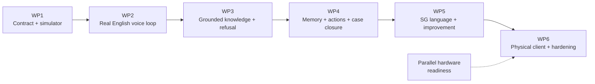
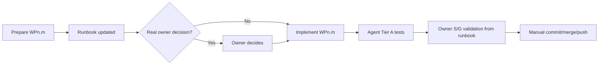

# KaKi-Talkie MVP execution plan

**Six work packages, decomposed into bounded implementation units with independent test checkpoints**

Version 1.13 | 18-Sep-2026 | SGLN Group 10

> v1.13 corrects the WP6.6 regression scope after the plan turn. A
> per-device reply-language override has to touch the turn pipeline, so
> WP6.1 reruns at tier A and tier B. WP6.1 tier B runs against mock I/O on
> the Mac and needs no Raspberry Pi; v1.12 said otherwise and was wrong.
> v1.12 adds WP6.6, the demo admin surface, and withdraws WP6.3 after the
> owner dropped the thermal printer on 18-Sep-2026. WP6-AT-09 is
> withdrawn; WP6-AT-15 to WP6-AT-18 are added. Unit numbers are identity,
> not sequence: WP6.6 is built before WP6.2 because it needs no hardware.
> v1.11 adds the physical audio rule to WP6.2 (design section 4.3) and
> moves the execution point to WP6.2 after WP6.1 was implemented.
> v1.10 reduces WP5 to WP5.1 and a timeboxed WP5.2 viability check.
> WP5.3, WP5.4, WP5.5 and WP5.6 are deferred beyond the MVP, and the
> live lookup leaves the baseline decisions.
> v1.8 rules that any case follow-up shown at the prototype pitch is
> scripted canned-mode illustration, never built behaviour, and never a
> second path inside the live pipeline.
> v1.7 defers the human handoff and calendar capabilities, and their
> Telegram and Google Calendar integrations, beyond the MVP. WP4.3 and
> WP4.4 are withdrawn from the build sequence. WP4.5 keeps presenter
> controls, backup and the package gate. WP4-AT-07 to WP4-AT-12 and
> WP6-AT-06 and WP6-AT-07 are withdrawn. Acceptance identifiers are not
> renumbered, so earlier evidence stays readable.
> v1.6 removes WP3-AT-09 (secret redaction) and the secret-handling scope
> from WP3.4 after an owner decision that redaction creates a false
> security promise the MVP cannot defend. GP4 stays as a credential-action
> refusal.
> v1.5 removes the retired Windows desktop and the named coding agent from
> sections 1.2, 1.5, 1.6, 1.8 and 11. Development, Tier A and Tier B all
> run on the Mac Mini.
> v1.4 adds the WP3 corpus-capture note: manual owner-reviewed markdown
> sources, four-source corpus, `capture: manual` allowlist flag.

Suggested repository location: `docs/04-prototype/execution-plan.md`

This document translates `docs/04-prototype/design.md` into a build sequence.

`design.md` is the architecture source of truth. This execution plan owns work-package scope, implementation-unit boundaries, acceptance criteria and delivery gates. Operational installation/setup/test commands live only in `docs/04-prototype/wp-validation-runbook.md`.

The process is deliberately light enough for a solo prototype. The coding agent should move quickly inside one implementation unit; the owner controls product/architecture decisions and gate closure.

---

## 1. How to use this plan

### 1.1 Gate chain



A package closes when:

1. its acceptance criteria pass in the appropriate environment;
2. the deterministic suites pass, and the within-package regression rule
   below is satisfied;
3. the owner completes the S/G validation defined in the validation runbook;
4. its Definition of Done is satisfied.

#### Within-package regression rule

Owner decision, 13-Sep-2026. An implementation unit `WPm.n` reruns the
tier B check of an earlier unit only when both of these hold:

1. the earlier unit sits in the same work package, that is `WPm.k` where
   `k < n`; and
2. `WPm.n` changed code that the earlier unit's check exercises.

Units in earlier work packages are not rerun at tier B. Validating WP4.5
therefore never reruns WP2.3 or WP3.4.

Earlier work packages keep their cover from three things that run on
every validation, whatever the rule above decides:

- the deterministic suites: ruff, and the contract, unit, rag and
  scripts suites the unit touches;
- the cross-cutting criteria X-AT-01 (the WP1 turn schema snapshot is
  unchanged) and X-AT-03 (no runtime database or vector data is
  tracked);
- the golden paths in `run_regression.py`, which exercise the whole
  pipeline end to end.

Tier B reruns cost owner time and need the live model services. The
deterministic suites cost neither, and they are what catches a break in
an earlier work package.

**Shared files are the exception to watch.** `wp_check.py`,
`kaki_env.sh`, `dev_stack.py` and `run_regression.py` serve every unit.
Adding a branch for the current unit does not touch an earlier one.
Changing a shared function, a shared default or a shared code path does,
and then every earlier unit in the same package reruns. State which of
the two a change is, in the unit's runbook block.

### 1.2 WP versus implementation unit

```text
+----------------------+--------------------------------------------------+
| Level                | Purpose                                          |
+----------------------+--------------------------------------------------+
| Work package         | Delivery milestone and end-to-end gate           |
| Implementation unit  | Normal agent build/review/test boundary          |
| Acceptance test      | Behaviour that must be proven                    |
| R/S/G owner level    | Human review/smoke/package-gate requirement      |
+----------------------+--------------------------------------------------+
```

Do not split work file-by-file. Keep one coherent behaviour together.

### 1.3 Owner validation levels

```text
+-------+---------------+--------------------------------------------------+
| Level | Name          | Owner action                                     |
+-------+---------------+--------------------------------------------------+
| R     | Review        | Review diff + completion summary/test results    |
| S     | Smoke         | Do R, then exercise the new observable behaviour|
| G     | Package gate  | Follow the complete WP gate in the runbook       |
+-------+---------------+--------------------------------------------------+
```

The runbook contains the actual commands and steps.

### 1.4 Decision classes

Use the decision model in `AGENTS.md`:

- **locked architecture** needs explicit owner approval to change;
- **baselined but changeable MVP choices** may be revised by the owner's latest explicit direction;
- **implementation choices** are made by the coding agent inside the active IU.

This prevents stale optional choices from becoming accidental hard requirements.

### 1.5 Runbook-first workflow



`Prepare WPn.m` is allowed to update the active runbook section without another pre-approval cycle. It does not change application code.

`Implement WPn.m` uses the prepared runbook and does not require the owner to repeat safeguards in the prompt.

### 1.6 Test tiers

```text
+--------+---------------------+---------------------------------------------+
| Tier   | Environment         | Typical evidence                            |
+--------+---------------------+---------------------------------------------+
| A      | Any machine + CI    | lint, unit, contract, schema, web build     |
| B      | Mac Mini            | STT/LLM/TTS/RAG, regression, latency       |
| C      | Raspberry Pi        | GPIO, audio, printer, boot/recovery        |
+--------+---------------------+---------------------------------------------+
```

Tier A runs with the `KAKI_*` mode switches cleared, so it never reaches a live
service. A Tier B/C test that the coding agent does not run is performed by the
owner from the runbook.

### 1.7 Golden-path suite

From WP3 onward:

```text
+----+---------------------------------------------------------------+
| GP | Must-pass behaviour                                          |
+----+---------------------------------------------------------------+
| 1  | CDC question -> grounded CDC answer + provenance             |
| 2  | Singpass reset -> official procedural guidance              |
| 3  | Unsupported question -> refusal                              |
| 4  | Authentication/credential action -> refuse                   |
| 5  | Insufficient evidence -> refusal instead of improvisation    |
+----+---------------------------------------------------------------+
```

### 1.8 Per-unit completion report

Keep it concise:

```text
Implemented:
Files changed:
Development dependencies:
Tests run/results:
Tests not run and why:
Runbook section/status:
Decisions or limitations:
Later scope untouched: yes/no
```

Do not duplicate owner procedures from the runbook.

---

## 2. WP1 - contract + simulator

**Status: CLOSED 05-Sep-2026 at tested commit `6ef5342`.**

Goal: fix the public client contract and prove it end to end with a canned backend.

### Implementation units

```text
+-------+-----------------------------------------------+-------+
| IU    | Build together                                | Owner |
+-------+-----------------------------------------------+-------+
| WP1.1 | FastAPI bootstrap, health, turn contract,    | S     |
|       | canned pipeline and baseline backend tests   |       |
| WP1.2 | pending, ports, state enum, idempotency,     | S     |
|       | timing/failure semantics and schema snapshot |       |
| WP1.3 | simulator recording/chime/15s/states/API/    | S     |
|       | audio/display/receipt rendering              |       |
| WP1.4 | localhost/deployment/Cloudflare/CI/WP1 gate  | G     |
+-------+-----------------------------------------------+-------+
```

Acceptance ownership:

```text
WP1.1 -> WP1-AT-01, 02, 06
WP1.2 -> WP1-AT-03, 04, 05, 07, 12
WP1.3 -> WP1-AT-08, 09, 10
WP1.4 -> WP1-AT-11 + complete WP1 regression/gate
```

Acceptance criteria retained from the closed package:

```text
WP1-AT-01 valid multipart turn -> HTTP 200 + response model
WP1-AT-02 missing turn_id -> controlled validation response
WP1-AT-03 repeated turn_id -> stored first result; pipeline once
WP1-AT-04 empty audio -> failed + calm non-empty reply
WP1-AT-05 pending -> HTTP 200 + well-formed empty list
WP1-AT-06 health -> HTTP 200 + application version
WP1-AT-07 timing structure contains required keys
WP1-AT-08 simulator lint/build/tests pass
WP1-AT-09 recording stops at 15 seconds
WP1-AT-10 receipt fits <=40-word slip without word truncation
WP1-AT-11 backend default bind is localhost-only
WP1-AT-12 turn schema snapshot passes unchanged
```

Runbook: section 6 for regression reference.

---

## 3. WP2 - real English voice loop

Goal: replace canned inference ports with the locked local English baseline. No retrieval yet.

### Implementation units

```text
+-------+-----------------------------------------------+-------+
| IU    | Build together                                | Owner |
+-------+-----------------------------------------------+-------+
| WP2.1 | audio handling + 16 kHz mono PCM normalise   | S     |
| WP2.2 | whisper.cpp STT/readiness/audio lifecycle    | S     |
| WP2.3 | MLX/Qwen adapter + minimal generation path   | S     |
| WP2.4 | macOS say/full loop/debug/dev scripts/latency| G     |
+-------+-----------------------------------------------+-------+
```

Primary browser policy: **Chrome is the MVP acceptance browser. Safari is best-effort and non-gating.** The simulator is a test surface, not the final product UI.

Acceptance ownership:

```text
WP2.1 -> WP2-AT-01
WP2.2 -> WP2-AT-02, 03, 07, 08
WP2.3 -> WP2-AT-04
WP2.4 -> WP2-AT-05, 06, 09, 10, 11, 12
```

Acceptance criteria:

```text
WP2-AT-01 current Chrome audio fixture normalises to 16 kHz mono WAV
WP2-AT-02 Whisper fixed English fixture transcribes usefully
WP2-AT-03 STT returns non-empty language evidence where supported
WP2-AT-04 MLX/Qwen returns <=60-word reply for fixed request in five runs
WP2-AT-05 macOS say adapter returns playable non-zero-duration audio
WP2-AT-06 full turn returns answered + reply/display/audio
WP2-AT-07 raw audio absent after STT by default
WP2-AT-08 deliberate retain mode keeps only explicit test audio
WP2-AT-09 invoked timing stages and overall timing are >0; retrieval stays unused
WP2-AT-10 health reports STT/LLM/TTS readiness
WP2-AT-11 latency script reports p50 and p95; no invented threshold
WP2-AT-12 WP1 contract/schema regression remains green
```

Out of scope: RAG, SQLite, DSPy, MERaLiON, SEA-LION, OmniVoice, streaming endpoint.

Runbook: sections 7.1-7.4.

Definition of Done: applicable Tier A/B criteria pass, p50/p95 recorded, raw-audio deletion proven, WP1 contract retained.

---

## 4. WP3 - grounded knowledge + refusal

Goal: make supported answers evidence-backed, sourced and bounded using static trusted retrieval before live lookup.

### Implementation units

```text
+-------+-----------------------------------------------+-------+
| IU    | Build together                                | Owner |
+-------+-----------------------------------------------+-------+
| WP3.1 | allowlist, fetch/snapshot, clean/chunk,      | S     |
|       | provenance                                    |       |
| WP3.2 | multilingual embeddings, Chroma, hybrid     | S     |
|       | retrieval/merge                               |       |
| WP3.3 | grounded answerer + application provenance  | S     |
|       | + output/slip                                 |       |
| WP3.4 | refusal/no-coverage/devset/                 | G     |
|       | golden paths                                  |       |
+-------+-----------------------------------------------+-------+
```

Acceptance ownership:

```text
WP3.1 -> WP3-AT-01, 02
WP3.2 -> WP3-AT-03, 04, 10
WP3.3 -> WP3-AT-06, 07
WP3.4 -> WP3-AT-05, 08, 11, 12, 13
```

Acceptance criteria:

```text
WP3-AT-01 ingestion writes dated runtime snapshots under KAKI_DATA_ROOT
WP3-AT-02 unchanged re-ingestion keeps hashes stable and avoids duplicate chunks
WP3-AT-03 CDC query returns CDC evidence in top three
WP3-AT-04 exact CHAS term proves lexical path
WP3-AT-05 insufficient evidence -> refusal/no coverage
WP3-AT-06 answered regression sources are allowlisted
WP3-AT-07 slip <=40 words + source + Source checked date
WP3-AT-08 unsupported/authentication-action requests refuse
WP3-AT-10 Malay/Singlish/code-switch fixtures exercise original + normalised retrieval
WP3-AT-11 regression reports results; initial intent target >=80%
WP3-AT-12 all five golden paths pass
WP3-AT-13 WP1/WP2 regressions remain green
```

Golden paths are defined in section 1.7.

Corpus capture: MVP sources are captured manually as owner-reviewed
markdown and seeded as dated snapshots (design.md 7.2). The allowlist
marks them `capture: manual`; the pipeline never fetches them live.
WP3-AT-01 and WP3-AT-02 apply to the seeded snapshots. The corpus
holds four sources (Singpass reset, CDC Vouchers, CHAS, CareShield
Life); golden paths GP1 and GP2 are covered.

Generated snapshots/processed data belong under `KAKI_DATA_ROOT`, not Git. Deliberate deterministic fixtures are the narrow exception.

Runbook: section 8, expanded by `Prepare WP3.x`.

---

## 5. WP4 - memory + deterministic actions

Goal: add durable memory and deterministic local actions. Prove the full software memory and action flow through the simulator before Pi integration.

### Implementation units

```text
+-------+-----------------------------------------------+-------+
| IU    | Build together                                | Owner |
+-------+-----------------------------------------------+-------+
| WP4.1 | SQLite schema/migrations/repositories +       | S     |
|       | durable turn idempotency                      |       |
| WP4.2 | repeat_previous/print_previous/print policy   | S     |
| WP4.3 | DEFERRED beyond MVP - kaki handoff +          | -     |
|       | HandoffPort adapter                           |       |
| WP4.4 | DEFERRED beyond MVP - calendar +              | -     |
|       | Google Calendar adapter                       |       |
| WP4.5 | backup + restore test + WP4 gate              | G     |
+-------+-----------------------------------------------+-------+
```

WP4.5 no longer delivers presenter controls. The owner withdrew them on
13-Sep-2026 (ADR-0008 decision 1).

### Deferred capabilities (owner decision, 13-Sep-2026)

The **handoff and calendar capabilities are deferred beyond the MVP**, together with their Telegram and Google Calendar integrations. They are not part of the prototype presentation.

What this removes from the build:

```text
- WP4.3 and WP4.4 in full;
- the HandoffPort and calendar adapters;
- the cases table and every migration that would create it;
- the kaki_handoff and calendar_create intents;
- pending delivery and follow-up state.
```

What stays true: a question that needs a person returns the WP3.4 refusal, which names a staff member in words and prints a slip. `GET /api/device/pending` returns an empty list for the whole MVP. No Telegram account, bot token, Google account or test calendar is needed at any point.

Reintroduce either capability only by an explicit owner decision that also names the channel, the test account and the acceptance criteria.

#### Demonstrating a follow-up at the pitch

The owner may still want to show what a follow-up would feel like. If so, script it in the existing canned mode (WP6-AT-08 and WP6-AT-11), which is already a declared scripted surface.

```text
- allowed:  a scripted follow-up scenario in canned mode, labelled as
            illustration when presented;
- refused:  a hardcoded follow-up branch inside the live pipeline;
- refused:  a cases table, a pending row or any stored follow-up state
            created to support the demonstration.
```

A hardcoded branch in the live pipeline would contradict the withdrawn acceptance criteria above and leave a second code path for somebody to find and remove later. Canned mode costs nothing to remove because it is already understood to be scripted.

Acceptance ownership:

```text
WP4.1 -> WP4-AT-01, 02, 03
WP4.2 -> WP4-AT-04, 05, 06
WP4.3 -> deferred; WP4-AT-07 and 08 withdrawn
WP4.4 -> deferred; WP4-AT-09 withdrawn
WP4.5 -> WP4-AT-13, 14; WP4-AT-10, 11 and 12 withdrawn
```

Acceptance criteria:

```text
WP4-AT-01 completed turn durably stored
WP4-AT-02 grounded turn stores one turn_sources row per source
WP4-AT-03 restart + same turn_id returns stored response without re-execution
WP4-AT-04 repeat_previous calls no LLM; stored text unchanged
WP4-AT-05 print_previous returns stored slip unchanged
WP4-AT-06 on_request policy does not print until requested
WP4-AT-07 WITHDRAWN - handoff deferred beyond MVP
WP4-AT-08 WITHDRAWN - handoff deferred beyond MVP
WP4-AT-09 WITHDRAWN - calendar deferred beyond MVP
WP4-AT-10 WITHDRAWN - follow-up has no case to act on
WP4-AT-11 WITHDRAWN - follow-up has no case to act on
WP4-AT-12 WITHDRAWN - follow-up has no case to act on
WP4-AT-13 action regression intent target >=80%
WP4-AT-14 golden paths + earlier contract tests pass
```

Caregiver application/pairing/history UI remains out of MVP scope. Morning scheduler automation remains deferred unless explicitly reintroduced.

Runbook: section 9, expanded by `Prepare WP4.x`.

---

## 6. WP5 - Singapore language

Goal: make the Malay path work on the validated baseline, and check whether a
Singapore-specific STT model is worth adopting. Owner decision, 13-Sep-2026:
WP5 is one build unit and one timeboxed check. Everything else moves beyond
the MVP, so WP6 gets the time the pitch actually needs.

### Implementation units

```text
+-------+-----------------------------------------------+-------+
| IU    | Build together                                | Owner |
+-------+-----------------------------------------------+-------+
| WP5.1 | language policy + baseline Malay path         | S     |
| WP5.2 | MERaLiON STT viability check (timeboxed)      | S     |
| WP5.3 | DEFERRED beyond MVP (13-Sep-2026)             | -     |
| WP5.4 | DEFERRED beyond MVP (13-Sep-2026)             | -     |
| WP5.5 | DEFERRED beyond MVP (13-Sep-2026)             | -     |
| WP5.6 | DEFERRED beyond MVP (13-Sep-2026)             | -     |
+-------+-----------------------------------------------+-------+
```

Deferral reasons, recorded so they are not relitigated:

```text
+-------+------------------------------------------------------------+
| IU    | Reason                                                     |
+-------+------------------------------------------------------------+
| WP5.3 | SEA-LION is a challenger with no measured baseline limit    |
|       | to justify it. The Qwen baseline answers the golden paths.  |
| WP5.4 | OmniVoice is the wanted localised TTS. The macOS            |
|       | Indonesian voice carries Malay well enough for the pitch.   |
| WP5.5 | The DSPy migration's best case is parity (former AT-06).    |
|       | It pays off with an optimiser and a devset, after the       |
|       | pitch.                                                      |
| WP5.6 | The live lookup adds a network call, a failure mode and     |
|       | unbounded latency inside the turn loop. No golden path      |
|       | needs it, and design.md 7.5 already refuses on volatile     |
|       | questions rather than serving a stale snapshot.             |
+-------+------------------------------------------------------------+
```

WP5.2 is a viability check, not a benchmark. It runs on the WP5.1 demo sample
in one voice, so it answers "does MERaLiON install, run and transcribe Malay
and code-switch clips visibly better or worse than Whisper" and nothing more.
A recorded keep-baseline result completes it. The timebox is 30 minutes; on
expiry, record keep-baseline and stop.

Acceptance ownership:

```text
WP5.1 -> WP5-AT-01, 02, 03, 04, 12
WP5.2 -> WP5-AT-08
```

Acceptance criteria:

```text
WP5-AT-01 curated Malay -> Malay reply/display + English slip
WP5-AT-02 curated code-switch cases match expected response language
WP5-AT-03 human sample judges SG English natural/not exaggerated
WP5-AT-04 Malay CDC utterance retrieves CDC evidence in top three
WP5-AT-05 WITHDRAWN - localised Malay TTS deferred beyond MVP; the
          macOS Indonesian voice is the MVP baseline
WP5-AT-06 WITHDRAWN - DSPy migration deferred beyond MVP
WP5-AT-07 WITHDRAWN - DSPy migration deferred beyond MVP
WP5-AT-08 viability check ends in a recorded keep-baseline or promote
          decision, with the sample's limits stated
WP5-AT-09 WITHDRAWN - SEA-LION challenger deferred beyond MVP
WP5-AT-10 WITHDRAWN - live lookup deferred beyond MVP
WP5-AT-11 WITHDRAWN - live lookup deferred beyond MVP
WP5-AT-12 golden paths + earlier contract tests remain green
```

Retrieval is already built. WP3.2 and WP3.3 deliver hybrid retrieval over the
original transcript and the normalised English query (`design.md` 7.4), so
WP5.1 adds no retrieval code. AT-04 verifies the existing path against Malay
input.

Speech data: the consented multi-speaker Singapore speech set is deferred
beyond the MVP with the bake-off it would have served. WP5.1 records only the
owner-voice utterances its single tier B turn needs, stored under
`KAKI_DATA_ROOT` as a demo sample.

Runbook: section 10, expanded by `Prepare WP5.x`.

---

## 7. WP6 - physical client + demo hardening

Goal: connect the working software MVP to the Raspberry Pi without changing the backend contract.

### Implementation units

```text
+-------+-----------------------------------------------+-------+
| IU    | Build together                                | Owner |
+-------+-----------------------------------------------+-------+
| WP6.1 | thin Pi state loop/config/API/mock I/O       | S     |
| WP6.2 | button/debounce/audio/LED integration        | S     |
| WP6.3 | WITHDRAWN - printer dropped 18-Sep-2026      | -     |
| WP6.4 | service auth/retry same turn_id/systemd      | S     |
| WP6.5 | pending/action regression/canned/demo freeze | G     |
| WP6.6 | demo admin surface: language toggle + push   | S     |
+-------+-----------------------------------------------+-------+
```

Acceptance ownership:

```text
WP6.1 -> WP6-AT-13
WP6.2 -> WP6-AT-01, 02, 03 where enabled
WP6.3 -> WITHDRAWN
WP6.4 -> WP6-AT-04, 05, 10
WP6.5 -> WP6-AT-06, 07, 08, 11, 12, 14
WP6.6 -> WP6-AT-15, 16, 17, 18
```

Acceptance criteria:

```text
WP6-AT-01 debounce -> one press
WP6-AT-02 recording stops at 15 seconds
WP6-AT-03 optional double-press repeat does not interfere with hold-to-talk
WP6-AT-04 timed-out retry reuses same turn_id
WP6-AT-05 unauthenticated device request denied before turn processing
WP6-AT-06 WITHDRAWN - handoff and calendar deferred beyond MVP
WP6-AT-07 WITHDRAWN - pending follow-up deferred beyond MVP
WP6-AT-08 network-down canned mode advances five scripted responses
WP6-AT-09 WITHDRAWN - thermal printer dropped from the build
          18-Sep-2026; no unit prints
WP6-AT-10 systemd recovers after process kill/power cycle
WP6-AT-11 simulator canned mode exposes same five scenarios
WP6-AT-12 BOM <= SGD 450
WP6-AT-13 device static inspection finds no model/RAG/prompt/case-decision logic
WP6-AT-14 golden paths + earlier contract tests remain green
WP6-AT-15 an admin language change alters the next turn's reply
          language, with no service restart
WP6-AT-16 an admin push plays once on the client; repeated polling does
          not replay it
WP6-AT-17 an unauthenticated /api/admin/* request is rejected before any
          state change
WP6-AT-18 the same push and language change run from a loopback curl
          script on the Mac Mini when the tunnel is unavailable
```

WP6.2 audio follows design section 4.3: capture at 16 kHz mono, and convert all playback to 48 kHz stereo. The owner checks playback by ear during the WP6.2 smoke test (level S). No separate acceptance test covers playback speed (owner decision, 17-Sep-2026).

### WP6.6 - demo admin surface

WP6.6 gives the pitch a second operator. A colleague opens `/admin` on a
phone, switches the reply language between English and Malay, and
releases one canned push message: new CDC vouchers are available. The
architecture is `design.md` section 5.5.

Build order. Unit numbers are identity, not sequence. WP6.6 is numbered
last and built early, because it needs no hardware:

```text
WP6.1 -> WP6.6 -> WP6.2 -> WP6.4 -> WP6.5
```

Two constraints bind the unit:

- WP6-AT-13 still holds. The device gains no request path, no `KAKI_`
  variable outside `KAKI_DEVICE_*`, and no admin logic. It learns of a
  push through the existing pending endpoint.
- Shared-file changes stay additive. Adding a WP6.6 branch to
  `wp_check.py`, `kaki_env.sh` or `dev_stack.py` triggers nothing.
  Changing a shared function, default or code path reruns WP6.1
  (section 1.1).

Regression scope for WP6.6: **WP6.1 at tier A and tier B.** The
per-device reply-language override is resolved inside the turn pipeline,
which WP6.1's scripted mock-I/O turn exercises. That check runs on the
Mac against the grounded stack and needs no Raspberry Pi, so the rerun
costs one command.

Push content is one message. A second canned push is scope creep with no
demo value: the pitch shows the mechanism once.

WP6.3 is withdrawn, so no unit prints. The backend still produces
`slip_text` and the simulator still renders the 58 mm mock, so the
printed-slip story survives the hardware loss.

Tailscale Serve remains optional. Long-press reprint remains deferred. Caregiver UI remains out of scope.

Runbook: section 11, expanded by `Prepare WP6.x`.

---

## 8. Cross-package acceptance

```text
X-AT-01 turn-response schema remains WP1-compatible unless explicitly revised
X-AT-02 newest-first code histories are advisory conventions, not acceptance or CI gates (see AGENTS.md)
X-AT-03 no secret-bearing files or runtime DB/vector data are tracked
X-AT-04 earlier acceptance tests are not weakened merely to obtain green
```

---

## 9. Current baseline decisions

```text
+----+--------------------------------------+-----------------------------------------+
| #  | Item                                 | Current baseline                        |
+----+--------------------------------------+-----------------------------------------+
| 1  | Live lookup placement                | deferred beyond MVP (13-Sep-2026);      |
|    |                                      | volatile questions refuse per design 7.5|
| 2  | Browser/device Cloudflare auth       | human Access / physical service auth    |
| 3  | Handoff capability + channel         | deferred beyond MVP (13-Sep-2026)       |
| 4  | Calendar capability + channel        | deferred beyond MVP (13-Sep-2026)       |
| 5  | LLM runtime baseline                 | MLX-LM                                  |
| 6  | English TTS baseline                 | macOS say                               |
| 7  | Pi print policy                      | auto for demo baseline                  |
| 8  | Caregiver application                | out of MVP                              |
| 9  | Tailscale Serve                      | optional hardening                      |
| 10 | Generated corpus snapshots           | KAKI_DATA_ROOT outside Git              |
| 11 | Long-press reprint                    | deferred                                |
| 12 | Browser acceptance                   | Chrome required; Safari best-effort     |
+----+--------------------------------------+-----------------------------------------+
```

The owner's latest explicit direction may change items that are baselined-but-changeable under `AGENTS.md`.

---

## 10. Schedule protection

```text
+-----+----------------+------------------------------------------+
| WP  | Target         | Main risk                                |
+-----+----------------+------------------------------------------+
| WP1 | 2-5 Sep        | CLOSED 05-Sep-2026                      |
| WP2 | 6-9 Sep        | local model/runtime integration         |
| WP3 | 10-14 Sep      | source cleaning/retrieval quality       |
| WP4 | 15-17 Sep      | persistence and deterministic actions   |
| WP5 | 13-14 Sep      | Malay quality below demo standard       |
| WP6 | 23-27 Sep      | hardware/integration surprises          |
+-----+----------------+------------------------------------------+
```

Protect the date:

- working baselines ship when challengers do not justify themselves;
- optional Safari compatibility does not block the MVP;
- deferring handoff and calendar removes the two external integrations that carried the most schedule risk;
- optional Tailscale Serve does not block freeze;
- optional Hokkien does not block the baseline, and remains a stretch
  goal beyond the MVP;
- WP5 reduced to one build unit returns eight days to WP6, where the
  Pi integration carries the remaining unknowns;
- caregiver UI does not exist in this MVP schedule.

Current execution point: **WP6.6**.

---

## 11. Agent handoff

The normal prompts are intentionally short because repository rules carry the detail.

### 11.1 Prepare an IU

> Prepare **WPn.m**. Follow `AGENTS.md`, `design.md`, `execution-plan.md` and the validation runbook. Update the active WPn.m runbook section only, inspect the repository, and report only real product/architecture decisions or blockers plus the expected implementation areas. Do not implement code yet.

### 11.2 Implement an IU

> Implement **WPn.m**. Follow the prepared runbook and repository safeguards. Make normal implementation choices yourself. Stop only for a real product/architecture decision or if work would cross the WPn.m boundary. Run the applicable tests and do not commit or push.

### 11.3 Close a package

> Review completed **WPn** against its acceptance criteria. Run available automated regressions, point me to the exact WPn package-gate section in the validation runbook, and report only failures, unavailable checks or unresolved limitations. Do not mark the owner gate passed on my behalf.

---

## 12. Document history

```text
+---------+-------------+------------------------------------------------------+
| Version | Date        | Change                                               |
+---------+-------------+------------------------------------------------------+
| 1.13    | 18-Sep-2026 | Corrected the WP6.6 regression scope to rerun      |
|         |             | WP6.1 at tier A and tier B, after the plan turn    |
|         |             | showed the language override must sit in the turn  |
|         |             | pipeline. Removed the wrong claim that WP6.1 tier  |
|         |             | B needs hardware.                                  |
| 1.12    | 18-Sep-2026 | Added WP6.6, the demo admin surface, with          |
|         |             | WP6-AT-15 to WP6-AT-18 and an explicit build       |
|         |             | order. Withdrew WP6.3 and WP6-AT-09 after the      |
|         |             | thermal printer was dropped from the build.        |
|         |             | Execution point moved to WP6.6.                    |
| 1.11    | 17-Sep-2026 | Added the design 4.3 audio rule to WP6.2, with an   |
|         |             | owner-ear playback check and no separate AT.        |
|         |             | Execution point moved to WP6.2.                     |
| 1.10    | 13-Sep-2026 | Reduced WP5 to WP5.1 plus a timeboxed WP5.2         |
|         |             | viability check. WP5.3, WP5.4, WP5.5 and WP5.6      |
|         |             | deferred beyond the MVP with reasons recorded.      |
|         |             | WP5-AT-05, 06, 07, 09, 10 and 11 withdrawn; AT-08   |
|         |             | reworded to a recorded decision. Live lookup left   |
|         |             | the baseline decisions. The consented speech set    |
|         |             | is deferred; WP5.1 uses an owner-voice demo sample. |
|         |             | Execution point moved to WP5.1.                     |
| 1.9     | 13-Sep-2026 | Added the within-package regression rule to 1.1:    |
|         |             | tier B reruns stay inside the work package and      |
|         |             | only when the current unit touches that unit's      |
|         |             | code. Earlier packages rely on the deterministic    |
|         |             | suites, X-AT-01, X-AT-03 and the golden paths.      |
| 1.8     | 13-Sep-2026 | Ruled that any pitch demonstration of case          |
|         |             | follow-up is scripted canned-mode illustration,     |
|         |             | not built behaviour and not a live-pipeline branch. |
| 1.7     | 13-Sep-2026 | Deferred the handoff and calendar capabilities and  |
|         |             | their Telegram and Google Calendar integrations     |
|         |             | beyond the MVP. Withdrew WP4.3, WP4.4, WP4-AT-07    |
|         |             | to 12, WP6-AT-06 and WP6-AT-07. WP4.5 keeps         |
|         |             | presenter controls, backup and the package gate.    |
| 1.6     | 12-Sep-2026 | Removed WP3-AT-09 (secret redaction) and secret-    |
|         |             | handling scope from WP3.4. GP4 stays as credential- |
|         |             | action refusal.                                     |
| 1.5     | 12-Sep-2026 | Mac Mini development model; removed retired Windows |
|         |             | and named-agent references; Tier A environment      |
|         |             | hygiene note.                                       |
| 1.4     | 10-Sep-2026 | WP3 manual corpus capture; four-source corpus.      |
| 1.3     | 06-Sep-2026 | Simplified agent workflow; made validation runbook  |
|         |             | the single operational source; Chrome primary;      |
|         |             | Safari non-gating; Telegram deferred to WP4.3;      |
|         |             | reduced stop/approval friction.                     |
| 1.2     | 05-Sep-2026 | Recorded WP1 closure at tested commit 6ef5342.     |
| 1.1     | 03-Sep-2026 | Added WPn.m implementation units and R/S/G levels. |
| 1.0     | 02-Sep-2026 | Baselined six-package plan.                         |
+---------+-------------+------------------------------------------------------+
```
