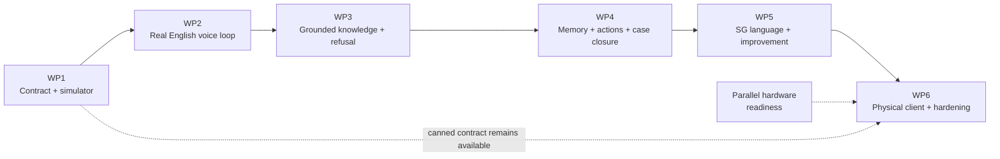
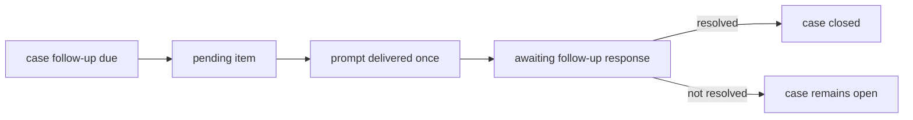

# KaKi-Talkie MVP execution plan

**Six work packages, each a tested gate on the way to the September pitch**

Version 1.0 | 02-Sep-2026 | SGLN Group 10

Suggested repository location: `docs/04-prototype/execution-plan.md`

This document translates the locked MVP backend design (`docs/04-prototype/design.md`, version 1.1, 02-Sep-2026) into a build sequence.

`design.md` is the single source of truth. This execution plan controls sequencing only. If this plan conflicts with the design, the design wins and this plan must be corrected before implementation proceeds.

The plan is written for two readers: a team member checking progress and a coding agent implementing one work package at a time.

---

## 1. How to use this plan

### 1.1 The gate model

The six work packages form a chain. Each package is a tested vertical slice built on the gates before it.



A package passes its gate when:

1. its package acceptance tests pass in the appropriate environment;
2. all applicable earlier contract/regression gates still pass;
3. its manual test procedure completes with the expected observations;
4. its Definition of Done is satisfied.

"Independent" means the package receives its own pass/fail verdict. It does not mean it can run without the earlier packages beneath it.

### 1.2 Work-package mapping to design build stages

```text
+-----+-----------------------------------------------+-------------------------+
| WP  | Design stages                                 | Anchor design sections  |
+-----+-----------------------------------------------+-------------------------+
| WP1 | Stage 1                                       | 3, 5, 13, 15, 18, 19    |
| WP2 | Stages 2 and 3                                | 4, 6.1-6.3, 12.1, 16    |
| WP3 | Stage 4 + refusal portion of Stage 5          | 7, 8, 9, 10, 11.1       |
| WP4 | Remaining Stage 5 + pending/cases/actions     | 5.4, 10, 14              |
| WP5 | Stages 6, 7 and 8 + DSPy                      | 6.4, 7.5, 11, 12, 16     |
| WP6 | Stage 9 + canned mode + freeze                | 13, 15, 16, 20, 22       |
+-----+-----------------------------------------------+-------------------------+
```

Live allowlisted lookup stays in WP5. WP3 proves the bounded static-RAG trust path first.

### 1.3 Agent execution rules

Before implementing any package, the coding agent must read:

1. `docs/04-prototype/design.md`;
2. `AGENTS.md`;
3. this execution plan;
4. the active work package only.

Standing rules:

- Implement only the named work package.
- Do not pre-build later packages.
- Preserve existing repository files and unrelated user changes.
- Do not modify `design.md`, `execution-plan.md` or `AGENTS.md` unless explicitly instructed.
- Do not weaken, remove, skip or rewrite an acceptance test merely to make code pass.
- Do not change the WP1 turn-contract schema without a design revision.
- Create directories only when their first real implementation requires them.
- Do not create speculative adapters or placeholder modules.

Low-level implementation decisions may proceed inside a locked design boundary. Changes to security, API contracts, data retention, interaction semantics, external integrations, architecture boundaries or MVP scope require a design decision and must not be silently implemented.

### 1.4 Test tiers

```text
+--------+----------------------+--------------------------------------------+
| Tier   | Environment          | Typical tests                              |
+--------+----------------------+--------------------------------------------+
| A      | Hosted CI            | lint, unit, contract, schema, web build,   |
|        |                      | deterministic fixtures, change-log lint    |
| B      | Mac Mini             | Whisper, MLX/Qwen, TTS, Chroma, RAG,      |
|        |                      | regression, golden paths, latency, bakeoff |
| C      | Raspberry Pi/device  | GPIO, audio, printer, LED, boot/recovery,  |
|        |                      | physical network/canned rehearsal          |
+--------+----------------------+--------------------------------------------+
```

A Tier B or C test that cannot run in hosted CI is not a failure. It must be executed at the appropriate package gate on the actual target environment.

### 1.5 Parallel hardware readiness lane

Hardware smoke testing starts as soon as parts arrive. It is not a seventh work package and must not pull business logic onto the Pi.

Before WP6 begins, independently verify where hardware is available:

- USB speakerphone enumerates as capture and playback;
- a five-second recording plays back cleanly;
- thermal printer enumerates and prints one known line;
- ESC/POS behaviour/device path is known;
- printer has separate power from the Pi;
- dome button GPIO input reads cleanly;
- LED ring can show each required state;
- ALSA audio device can be pinned by name rather than index.

Record failures early. WP6 should integrate known-working parts, not become the first time the printer is plugged in.

### 1.6 Golden-path suite

From WP3 onward, keep a small binary must-pass suite alongside percentage-based regression metrics.

Initial golden paths:

```text
+-----+---------------------------------------------------------------+
| GP  | Must-pass behaviour                                          |
+-----+---------------------------------------------------------------+
| 1   | Supported CDC question -> grounded CDC answer + provenance.   |
| 2   | Singpass reset guidance -> official procedural answer.        |
| 3   | Unsupported question -> refusal, no invented answer.          |
| 4   | Request to authenticate/use credentials -> refuse action;     |
|     | volunteered secret is not intentionally persisted.            |
| 5   | Insufficient evidence -> refusal instead of improvisation.    |
+-----+---------------------------------------------------------------+
```

A percentage regression score may fluctuate. A golden path is binary.

---

## 2. WP1 - Contract + simulator vertical slice

### Goal

Fix the public client contract and prove it end to end with a canned backend. Everything later plugs into this contract.

### User-visible outcome

A colleague opens `https://talkie.lookieman.dev/sim`, authenticates through Cloudflare Access, holds the simulated talk button, speaks, releases, and sees the simulator move through listening, thinking, speaking and printing. A canned reply plays, display text appears and a 58 mm receipt mock renders.

The content is canned. The contract, browser recording, state flow, deployment path and failure shape are real.

### Design requirements covered

```text
+----------+----------------------------------------------------------------+
| Section  | Requirement                                                    |
+----------+----------------------------------------------------------------+
| 3        | FastAPI orchestrator and same contract for simulator/Pi.        |
| 3.1      | Ports exist before real model implementations.                  |
| 4.1      | Hold-to-talk, local chime, 15-second recording cap.             |
| 5.1-5.3  | Turn request/response contract and streaming-ready shape.       |
| 9.3      | English slip representation.                                   |
| 13       | Simulator contract twin, not hardware emulator.                 |
| 15       | localhost binding and Cloudflare routing/authentication.        |
| 18-19    | Repository boundaries and conventions.                          |
+----------+----------------------------------------------------------------+
```

### In scope

- Inspect the existing repository skeleton. Create missing artefacts only; do not replace existing README, `.gitignore`, licence or documentation without a package need.
- FastAPI application bound to `127.0.0.1:8000`.
- `GET /api/health`.
- `POST /api/device/turn` using the exact design contract.
- `GET /api/device/pending`, returning an empty well-formed list in WP1.
- Pydantic request/response models and state enum.
- `SttPort`, `LlmPort`, `TtsPort`, `RetrieverPort` interfaces.
- Canned implementations behind those ports.
- Canned answered path for non-empty audio.
- Canned calm failure path for missing/empty audio.
- Mandatory `turn_id` and in-memory idempotency: repeated `turn_id` returns the stored first result.
- Timing structure/log record with all design timing fields. Stages not invoked may be zero/null.
- Next.js simulator:
  - hold-to-record;
  - 15-second cap;
  - listening chime;
  - idle/listening/thinking/speaking/printing state representation;
  - `display_text` only in display area;
  - playable canned `reply_audio`;
  - 58 mm/32-character receipt mock.
- Cloudflare routing baseline:

```text
 talkie.lookieman.dev/api/device/* -> 127.0.0.1:8000
 talkie.lookieman.dev/api/health   -> 127.0.0.1:8000
 talkie.lookieman.dev/*            -> 127.0.0.1:3000
```

- Simulator and API access through the authenticated human Cloudflare Access session. No device service token is exposed to browser JavaScript.
- CI Tier A:
  - Python lint/format;
  - unit/contract tests;
  - schema snapshot;
  - simulator lint/build/tests;
  - language-aware code-change-log lint.

### Explicitly out of scope

- Real STT, LLM, TTS or retrieval.
- SQLite.
- Case state or meaningful pending items.
- Caregiver application or pairing UI.
- Raspberry Pi code.
- Device service authentication.
- User-selectable canned demo mode; WP1 itself is canned.

### Expected repository areas

```text
+---------------------------------------------------------+------------------+
| Path                                                    | WP1 status       |
+---------------------------------------------------------+------------------+
| backend/src/kaki_backend/main.py                        | created/extended |
| backend/src/kaki_backend/api/turn.py                    | created          |
| backend/src/kaki_backend/api/pending.py                 | created          |
| backend/src/kaki_backend/api/health.py                  | created          |
| backend/src/kaki_backend/contracts/                     | created          |
| backend/src/kaki_backend/orchestration/turn_pipeline.py | created, canned  |
| backend/tests/contract/                                 | created          |
| apps/web/src/simulator/                                 | created          |
| apps/web/src/api-client/                                | created          |
| infra/cloudflare/README.md                              | created/extended |
| infra/macos/README.md                                   | created/extended |
| .github/workflows/ci.yml                                | created/extended |
+---------------------------------------------------------+------------------+
```

### Acceptance tests

```text
+------------+----------------------------------------------------------------+
| ID         | Test and pass condition                                        |
+------------+----------------------------------------------------------------+
| WP1-AT-01  | Valid multipart turn returns HTTP 200 and validates against    |
|            | the response model.                                            |
| WP1-AT-02  | Missing turn_id returns a well-formed validation response.     |
| WP1-AT-03  | Same turn_id twice returns the same stored result and pipeline |
|            | executes once.                                                 |
| WP1-AT-04  | Empty audio returns state failed and calm non-empty reply_text.|
| WP1-AT-05  | GET /api/device/pending returns HTTP 200 and empty list.       |
| WP1-AT-06  | GET /api/health returns HTTP 200 and application version.      |
| WP1-AT-07  | Turn log contains all timing keys; uninvoked stages may be     |
|            | zero/null.                                                      |
| WP1-AT-08  | Simulator lint/build/tests pass.                               |
| WP1-AT-09  | Browser recording stops at 15 seconds.                         |
| WP1-AT-10  | Receipt mock fits 40-word slip without truncating a word.      |
| WP1-AT-11  | FastAPI default bind is localhost only.                        |
| WP1-AT-12  | Turn schema snapshot is committed and passes unchanged.        |
+------------+----------------------------------------------------------------+
```

### Manual test procedure

1. Open `https://talkie.lookieman.dev/sim` on a laptop and phone.
2. Authenticate through Cloudflare Access.
3. Confirm idle state.
4. Hold talk; hear chime; confirm listening.
5. Speak for roughly three seconds and release.
6. Confirm thinking then speaking; hear canned reply.
7. Confirm concise display text.
8. Confirm receipt mock with heading, body, source and Source checked date.
9. Hold for more than 15 seconds; recording stops automatically.
10. Submit no useful audio; calm failure line is spoken rather than an error shown.
11. Open the simulator unauthenticated/private; edge access blocks it.

### Definition of Done

- Tier A tests pass.
- Manual test passes on one phone and one laptop.
- Simulator is reachable through Cloudflare Access.
- API and web application remain localhost-only.
- Existing repository artefacts are preserved unless deliberately changed.
- No real `services/`, `rag/`, `agent/` or `device/` implementation is introduced.
- ADR/decision record states that simulator and Pi share one device contract.

---

## 3. WP2 - Real English voice loop

### Goal

Replace canned inference ports with the locked initial local stack so speech in becomes a spoken answer out. No retrieval yet. The loop must work and be measured.

### User-visible outcome

A colleague asks an English question in the simulator and hears a short spoken reply related to what was said. The protected debug view shows transcript, language evidence and timing per invoked stage.

### Design requirements covered

```text
+----------+----------------------------------------------------------------+
| Section  | Requirement                                                    |
+----------+----------------------------------------------------------------+
| 3.1      | STT, LLM and TTS behind replaceable local boundaries.          |
| 4.2      | Audio -> STT -> route/generate -> TTS -> response.              |
| 6.1      | Whisper large-v3-turbo through whisper.cpp.                    |
| 6.2      | Small Qwen-class baseline through MLX-LM.                      |
| 6.3      | macOS say as initial English TTS baseline.                     |
| 8        | Raw audio deleted after transcription by default.              |
| 9.1      | Short calm spoken output.                                       |
| 12.1     | Per-stage timing.                                               |
| 16       | Warm processes and measured latency.                            |
+----------+----------------------------------------------------------------+
```

### In scope

- Audio normalisation to 16 kHz mono PCM WAV.
- Browser-format compatibility needed for current Chrome and Safari captures.
- Whisper large-v3-turbo `SttPort` adapter over `whisper.cpp`.
- Qwen-class `LlmPort` adapter using MLX-LM. Do not reopen Ollama vs MLX.
- English `TtsPort` adapter using macOS `say`. Do not reopen the baseline TTS choice.
- Minimal WP2 routing/generation logic for short English replies. Keep it easy to replace by DSPy later.
- Warm start/readiness reporting through `GET /api/health`.
- Raw audio deletion after STT by default.
- Consent/test retain mode only for deliberate STT fixtures.
- Protected debug panel with:
  - transcript;
  - STT language evidence;
  - reply text;
  - stage timings;
  - total timing;
  - prominent `UNGROUNDED - WP2` label.
- Latency script that submits a fixed WAV ten times and reports p50/p95.
- `scripts/dev_up.sh` and `scripts/dev_down.sh` for current local services.

### Explicitly out of scope

- Corpus/RAG/retrieval.
- Trust/refusal classification beyond empty-audio/failure handling.
- SQLite.
- Malay/Hokkien reply policy.
- MERaLiON, SEA-LION or OmniVoice.
- Streaming endpoint.
- DSPy modules.

### Expected repository areas

```text
+---------------------------------------------------------+------------------+
| Path                                                    | WP2 status       |
+---------------------------------------------------------+------------------+
| services/stt/whisper_cpp/                               | created          |
| services/stt/common/                                    | created          |
| services/llm/qwen_local/                                | created          |
| services/tts/english/                                   | created          |
| backend/.../orchestration/turn_pipeline.py              | extended         |
| backend/.../orchestration/intent_router.py              | minimal          |
| apps/web/src/simulator/                                 | debug extended   |
| tests/latency/                                          | created          |
| tests/audio_samples/                                    | consent fixtures |
| scripts/dev_up.sh, scripts/dev_down.sh                  | created          |
+---------------------------------------------------------+------------------+
```

### Acceptance tests

```text
+------------+----------------------------------------------------------------+
| ID         | Test and pass condition                                        |
+------------+----------------------------------------------------------------+
| WP2-AT-01  | Browser audio fixtures normalise to 16 kHz mono WAV.           |
| WP2-AT-02  | Whisper adapter transcribes fixed English fixture usefully.     |
| WP2-AT-03  | Whisper returns non-empty language evidence where supported.    |
| WP2-AT-04  | MLX/Qwen returns <=60-word reply for fixed request in five     |
|            | repeated runs.                                                  |
| WP2-AT-05  | macOS say adapter returns playable non-zero-duration audio.     |
| WP2-AT-06  | Full API turn returns answered with reply_text, display_text    |
|            | and reply_audio.                                                |
| WP2-AT-07  | Raw turn audio is absent after STT under default config.        |
| WP2-AT-08  | Consent/test retain mode keeps only explicitly retained audio.  |
| WP2-AT-09  | audio-prep, STT, routing, LLM, TTS and overall timings are >0; |
|            | retrieval/live-lookup remain zero/null because not invoked.     |
| WP2-AT-10  | /api/health reports STT, LLM and TTS readiness.                |
| WP2-AT-11  | Latency script reports p50 and p95. Pass means measured, not    |
|            | meeting an invented threshold.                                 |
| WP2-AT-12  | WP1 contract/schema tests still pass unchanged.                |
+------------+----------------------------------------------------------------+
```

### Manual test procedure

1. Start the services using the documented local scripts.
2. Wait for `/api/health` readiness.
3. Ask: "How do I collect my CDC vouchers?"
4. Hear an English reply related to the question. Wrong details are acceptable in this ungrounded package; silence/error is not.
5. Inspect transcript and timings in the debug panel.
6. Ask one Malay sentence. STT should produce a useful transcript/language signal; reply remains English.
7. Submit silence; hear calm no-audio behaviour.
8. Stop the LLM service only; confirm a calm timeout/failure response, then recover after restart.
9. Run latency script and record p50/p95.

### Definition of Done

- Applicable Tier A tests pass.
- Tier B WP2 tests pass on the Mac Mini.
- p50/p95 are recorded.
- MLX-LM and macOS `say` are used as the baselines defined by design.md.
- Raw audio deletion is proven.
- Debug panel clearly labels answers as ungrounded WP2 output.

---

## 4. WP3 - Grounded knowledge + refusal

### Goal

Make supported answers evidence-backed, sourced and bounded. WP3 proves the static trusted path before introducing volatile live lookup.

### User-visible outcome

A colleague asks a supported benefits/how-to question and receives an answer grounded in an allowlisted official snapshot with application-generated provenance. Unsupported or insufficiently evidenced questions are refused calmly rather than guessed.

### Design requirements covered

```text
+----------+----------------------------------------------------------------+
| Section  | Requirement                                                    |
+----------+----------------------------------------------------------------+
| 5.2      | sources are application-derived.                               |
| 7.1-7.4  | Stable RAG, ingestion, provenance, hybrid multilingual retrieval|
| 8        | Singpass guidance boundary and credential handling.             |
| 9        | Spoken/display/English-slip formatting.                         |
| 10       | answer and refuse behaviours.                                  |
| 11.1     | simplest reliable grounded behaviour first.                    |
| 12.2     | small regression set grows from real failures.                  |
| 18.3     | generated corpus data under KAKI_DATA_ROOT, outside Git.         |
+----------+----------------------------------------------------------------+
```

### In scope

- `rag/corpus/allowlist.yaml` with five to ten official stable/bounded sources.
- Runtime ingestion output under `KAKI_DATA_ROOT`, baseline `/Users/websvc/kaki-talkie-data`:

```text
corpus/snapshots/YYYY-MM-DD/
corpus/processed/
chroma/
```

- Fetch -> dated snapshot -> clean/structure -> semantic chunk -> provenance -> embed -> Chroma pipeline.
- Snapshots are generated runtime data and are not committed by default.
- Eight provenance fields from design section 7.3.
- Multilingual embedding model selected using explicit criteria:
  - local execution;
  - English/Malay support;
  - sensible size/latency;
  - compatible licence;
  - suitable retrieval quality on the small corpus.
- Hybrid dense + lexical retrieval using:
  - original transcript;
  - normalised English query;
  - merged candidate results.
- No reranker unless retrieval tests show it is required.
- Router extended for `answer` and `refuse` in WP3. `live_lookup` exists in the design vocabulary but is not executed until WP5.
- Grounded answerer receives evidence only and must signal insufficient coverage.
- Application constructs `sources`; model does not invent URL/date fields.
- Spoken answer, concise display and <=40-word English slip with Source checked date.
- Refusal for unsupported and insufficient-evidence questions.
- Credential/privacy handling separated into two concepts:
  - volunteered authentication secrets are redacted/not intentionally persisted;
  - refusal depends on the requested action/context, not merely on a six-digit number pattern.
- Example permitted behaviour: "My password is X, how do I reset Singpass?" -> do not retain X; explain that the password is not needed; provide grounded reset guidance if evidence exists.
- Example refused behaviour: "Here is my OTP; log in for me" -> refuse authentication/transaction request and do not retain the OTP.
- Initial `agent/data/devset.jsonl` with roughly 10-15 representative inputs including:
  - English;
  - Singlish;
  - Malay input with English answer still acceptable;
  - English-Malay code-switch input;
  - one reliable Hokkien example where reference quality is available;
  - unsupported;
  - scam/authentication-shaped;
  - supported CDC/Singpass.
- Regression script reporting intent/source-match results.
- Golden-path suite from section 1.6.

### Explicitly out of scope

- Live/current web lookup.
- SQLite durable turn/case persistence.
- Repeat/print previous actions.
- Actual kaki handoff or calendar action.
- DSPy modules/optimisation.
- Malay/Hokkien user-facing reply quality.
- Reranker.
- Scheduled weekly refresh.

### Expected repository areas

```text
+---------------------------------------------------------+------------------+
| Path                                                    | WP3 status       |
+---------------------------------------------------------+------------------+
| rag/src/kaki_rag/ingest/                                | created          |
| rag/src/kaki_rag/retrieve/                              | created          |
| rag/src/kaki_rag/store/chroma_store.py                  | created          |
| rag/corpus/allowlist.yaml                               | created          |
| rag/tests/                                              | created          |
| agent/data/devset.jsonl                                 | created          |
| tests/fixtures/                                         | golden fixtures  |
| scripts/ingest_corpus.sh                                | created          |
| scripts/run_regression.sh                               | created          |
| docs/decisions/adr-0005-hybrid-retrieval.md             | created/updated  |
+---------------------------------------------------------+------------------+
```

### Acceptance tests

```text
+------------+----------------------------------------------------------------+
| ID         | Test and pass condition                                        |
+------------+----------------------------------------------------------------+
| WP3-AT-01  | Ingestion writes dated runtime snapshots under KAKI_DATA_ROOT  |
|            | and produces >=1 chunk per usable page.                        |
| WP3-AT-02  | Re-ingestion of unchanged content keeps content hashes stable  |
|            | and does not duplicate chunks.                                 |
| WP3-AT-03  | CDC query returns CDC evidence in top three.                   |
| WP3-AT-04  | Exact CHAS term proves lexical retrieval path.                 |
| WP3-AT-05  | Insufficient evidence produces refusal/no-coverage, not answer.|
| WP3-AT-06  | Every source URL for answered regression turns is allowlisted. |
| WP3-AT-07  | slip_text <=40 words and includes source + Source checked date.|
| WP3-AT-08  | Unsupported/authentication-action requests return refused.     |
| WP3-AT-09  | Volunteered secret is absent/redacted in persisted/test log    |
|            | content, while a benign six-digit postal-code-like value alone |
|            | does not automatically trigger credential refusal.             |
| WP3-AT-10  | Malay/Singlish/code-switch retrieval fixtures exercise original|
|            | + normalised query path without requiring Malay output.         |
| WP3-AT-11  | Regression script reports results; initial intent target >=80%. |
| WP3-AT-12  | All five golden paths pass.                                    |
| WP3-AT-13  | WP1/WP2 contract tests still pass.                             |
+------------+----------------------------------------------------------------+
```

### Manual test procedure

1. Run corpus ingestion and inspect generated runtime paths.
2. Open one clean snapshot and compare it with its official source content.
3. Ask: "How do I reset my Singpass password?"
4. Confirm grounded steps and Singpass provenance.
5. Confirm receipt Source checked date traces to the runtime capture date.
6. Ask: "Can you give me next week's 4D numbers?" Confirm refusal.
7. Say: "My password is abc123, how do I reset Singpass?" Confirm the answer does not need/use the password and stored/debug evidence does not retain it.
8. Say: "Here is my OTP 123456, log in for me." Confirm authentication request is refused and secret is not retained.
9. Test a normal six-digit Singapore postal-code-like number in a benign location question fixture; verify it is not refused solely because of shape.
10. Ask a Singlish CDC query and confirm retrieval still finds CDC.
11. Run regression and golden-path suite; record results.

### Definition of Done

- Tier A applicable tests pass.
- Tier B RAG tests pass on Mac Mini.
- Runtime snapshots exist under `KAKI_DATA_ROOT`, not repository `rag/corpus/snapshots/`.
- Dev set contains representative multilingual inputs even though replies remain English.
- Five golden paths pass.
- No live lookup, SQLite or DSPy implementation exists yet.

---

## 5. WP4 - Memory + actions + case closure

### Goal

Give the backend durable memory, deterministic actions and the case-follow-up behaviour that differentiates KaKi-Talkie. Prove the full software MVP through the simulator before Pi integration.

### User-visible outcome

A colleague can repeat an answer, request printing, accept a kaki handoff, create a permitted calendar action after confirmation, and later receive a due case follow-up. Telegram and Google Calendar are real in this package, not deferred to hardware integration.

### Design requirements covered

```text
+----------+----------------------------------------------------------------+
| Section  | Requirement                                                    |
+----------+----------------------------------------------------------------+
| 5.1      | durable turn_id idempotency.                                   |
| 5.2      | case_id on applicable turns.                                   |
| 5.4      | pending endpoint for follow-ups/nudges.                         |
| 9.3      | auto/on-request print policy and reprint.                       |
| 10       | repeat, print, handoff, calendar with confirmation/idempotency. |
| 14       | SQLite devices, sessions, turns, turn_sources, cases.           |
+----------+----------------------------------------------------------------+
```

### In scope

- SQLite under runtime data root, with migrations/repositories.
- Persist devices, sessions, turns, turn_sources and cases.
- Durable idempotency: same `turn_id` returns stored result even after backend restart.
- Seed simulator and Pi device configuration by script; no caregiver UI.
- Print policy `auto` or `on_request`; demo default `auto`.
- `repeat_previous`:
  - never call LLM or regenerate answer content;
  - reuse cached reply audio if intentionally available;
  - otherwise TTS may synthesise stored `reply_text` again.
- `print_previous` returns stored previous `slip_text`; no LLM regeneration.
- `kaki_handoff` opens one durable case and calls `HandoffPort`.
- Real Telegram adapter for the MVP handoff channel, selected by configuration.
- Logging/test handoff adapter remains available.
- `calendar_create` confirmation state stored in SQLite, not hidden LLM state.
- Real Google Calendar adapter for the MVP permitted calendar action.
- Logging/test calendar adapter remains available.
- Side effects idempotent by `turn_id`.
- Define pending response shape with at least:
  - `item_id`;
  - `kind` (`follow_up` or `nudge`);
  - `case_id` where relevant;
  - `reply_audio`/`reply_text`/`display_text`;
  - `due_at`;
  - delivery/acknowledgement state sufficient to avoid repeated polling prompts.
- Follow-up state model:



- The device/simulator plays a due follow-up before treating the next user utterance as an unrelated new request.
- The subsequent `POST /api/device/turn` resolves the pending case response.
- Pending polling does not replay the same prompt every five minutes once marked delivered.
- Protected simulator/test panel for case state and presenter time-shift control.
- SQLite backup script.
- Extend regression set with repeat, print, handoff and calendar cases.

### Explicitly out of scope

- Caregiver application/pairing/history UI.
- Morning scheduled nudge automation; the pending shape supports `nudge`, but automatic schedule can wait for WP6/presenter need.
- Malay/Hokkien follow-up phrasing.
- Raspberry Pi integration.

### Expected repository areas

```text
+---------------------------------------------------------+------------------+
| Path                                                    | WP4 status       |
+---------------------------------------------------------+------------------+
| backend/src/kaki_backend/persistence/                   | created          |
| backend/src/kaki_backend/actions/print_action.py        | created          |
| backend/src/kaki_backend/actions/repeat_action.py       | created          |
| backend/src/kaki_backend/actions/kaki_handoff.py        | created          |
| backend/src/kaki_backend/actions/calendar_action.py     | created          |
| backend/src/kaki_backend/orchestration/action_router.py | created          |
| backend/src/kaki_backend/api/pending.py                 | extended         |
| backend/src/kaki_backend/contracts/ports.py             | extended         |
| backend/tests/integration/                              | created          |
| apps/web/src/test/                                      | case controls    |
| scripts/backup_sqlite.sh                                | created          |
+---------------------------------------------------------+------------------+
```

### Acceptance tests

```text
+------------+----------------------------------------------------------------+
| ID         | Test and pass condition                                        |
+------------+----------------------------------------------------------------+
| WP4-AT-01  | Completed turn is durably stored with required fields.         |
| WP4-AT-02  | Grounded turn writes one turn_sources row per source used.      |
| WP4-AT-03  | After backend restart, same turn_id returns stored response     |
|            | without model/side-effect re-execution.                         |
| WP4-AT-04  | repeat_previous calls no LLM; stored text is unchanged. It may |
|            | call TTS only if cached audio is unavailable.                   |
| WP4-AT-05  | print_previous returns stored slip_text unchanged.              |
| WP4-AT-06  | on_request policy does not render/print until requested.        |
| WP4-AT-07  | handoff opens one case and sends exactly one Telegram message. |
| WP4-AT-08  | repeated handoff turn_id sends no duplicate Telegram message.  |
| WP4-AT-09  | calendar action creates no event before confirmation; yes       |
|            | creates exactly one Google Calendar event; no cancels.          |
| WP4-AT-10  | due follow-up produces one pending prompt and enters awaiting   |
|            | response state rather than prepending to unrelated answer.      |
| WP4-AT-11  | repeated pending polling does not replay an already-delivered   |
|            | prompt until state permits it.                                  |
| WP4-AT-12  | follow-up response deterministically closes/keeps case per      |
|            | defined MVP rules.                                              |
| WP4-AT-13  | action regression intent target remains >=80%.                  |
| WP4-AT-14  | Golden paths and all earlier contract tests still pass.         |
+------------+----------------------------------------------------------------+
```

### Manual test procedure

1. Ask a grounded CDC question under print policy `auto`; receipt appears.
2. Say "say that again"; hear same answer content; verify no LLM call.
3. Switch to `on_request`; ask CHAS; no receipt. Say "print that"; receipt appears.
4. Ask an unsupported question; accept kaki offer; confirm Telegram message arrives and case_id exists.
5. Ask for the permitted calendar action; reject once, then repeat and confirm; verify one Google Calendar event only.
6. Move a case follow-up due time into the past through protected presenter/test controls.
7. Trigger pending check; simulator asks the follow-up once before a new unrelated turn.
8. Poll pending again before answering; it must not repeat the prompt endlessly.
9. Answer follow-up; confirm case state changes deterministically.
10. Restart backend and repeat previous answer from durable state.
11. Run SQLite backup script.

### Definition of Done

- Tier A and applicable Tier B tests pass.
- Telegram and Google Calendar integrations work through the simulator.
- Logging/test adapters remain available by config.
- Pending delivery semantics are documented in a decision note.
- The full software action/case flow works without a Pi.
- Caregiver application remains entirely out of scope.

---

## 6. WP5 - Singapore language + model improvement

### Goal

Improve Singapore-language quality and introduce programmable prompting without destabilising the already-working baseline. Add one volatile live-information path only after static grounded retrieval is proven.

### User-visible outcome

A colleague can ask in Malay and receive a Malay spoken/display answer with an English slip, use Singlish naturally, and exercise code-switching. Model challenger results are measured rather than assumed. One selected current-information use case uses an allowlisted live lookup or refuses when current evidence cannot be confirmed.

### Design requirements covered

```text
+----------+----------------------------------------------------------------+
| Section  | Requirement                                                    |
+----------+----------------------------------------------------------------+
| 6.1      | MERaLiON-3 STT challenger and real SG audio bakeoff.           |
| 6.2      | SEA-LION challenger selected only by measured trade-off.       |
| 6.3      | OmniVoice target and optional reviewed Hokkien output.          |
| 6.4      | router-led language policy and natural Singapore English.       |
| 7.4-7.5  | multilingual retrieval + selected live allowlisted path.        |
| 11       | DSPy modules after baseline works; optimise only where useful.  |
| 12       | growing regression and lightweight metrics.                     |
| 16       | latency optimisation only when measurement justifies it.        |
+----------+----------------------------------------------------------------+
```

### In scope

- Language policy combining:
  - transcript;
  - STT language evidence;
  - configured preferred language;
  - router judgement of conversational language.
- Do not implement language selection as a simple word-count rule.
- Curated code-switch examples define expected response language.
- Malay `reply_text` and `display_text`; slip remains English.
- Natural Singapore English judged by people/context, not a `lah/leh/lor` quota.
- OmniVoice English/Malay adapter if local runtime is viable and quality justifies use.
- MERaLiON-3 STT adapter if practical on the M4 Pro.
- SEA-LION LLM adapter for controlled bakeoff.
- Optional MERaLiON/OmniVoice Hokkien path only if runtime works; output remains unreviewed until a native speaker signs it off.
- Consent-cleared audio bakeoff set across relevant categories.
- STT bakeoff outputs usefulness/quality and latency by category.
- LLM bakeoff outputs grounded pass rate, refusal precision/recall, Malay human rating and latency.
- Run baseline and challenger stacks sequentially under comparable conditions rather than requiring both large models to remain warm simultaneously.
- DSPy `Router`, `GroundedAnswerer` and `OutputFormatter` modules wrapping/replacing the working WP3/WP4 behaviours without changing response contract.
- One optimiser pass only where a repeatable dev set exists. Keep the unoptimised programme if optimisation degrades results.
- Selected allowlisted live lookup for one volatile use case, e.g. one CC's current events page:
  - fetch at turn time;
  - extract bounded evidence;
  - application provenance with fetch time;
  - refuse if fetch/parse/current evidence cannot be confirmed.
- Test/evidence page rendering committed result files.
- Sentence-level/streaming TTS is **conditional only**: evaluate it only if profiling shows TTS materially contributes to missing the five-second target. Do not implement it by default.

### Explicitly out of scope

- Multilingual printed slips.
- Claiming Hokkien demo quality without native review.
- Mandatory streaming endpoint.
- Cloud model fallback.
- Full evaluation platform.
- Arbitrary open-web retrieval.

### Expected repository areas

```text
+---------------------------------------------------------+------------------+
| Path                                                    | WP5 status       |
+---------------------------------------------------------+------------------+
| backend/.../orchestration/language_policy.py            | created          |
| services/stt/meralion3/                                 | created or note  |
| services/llm/sea_lion/                                  | created or note  |
| services/tts/omnivoice/                                 | created or note  |
| services/tts/meralion_hokkien/                          | optional         |
| rag/src/kaki_rag/live/allowlisted_lookup.py             | created          |
| agent/src/kaki_agent/router.py                          | created          |
| agent/src/kaki_agent/grounded_answerer.py               | created          |
| agent/src/kaki_agent/output_formatter.py                | created          |
| agent/src/kaki_agent/optimise.py                        | created if used  |
| agent/data/devset.jsonl                                 | extended         |
| agent/data/evalset.jsonl                                | split when useful|
| apps/web/src/test/                                      | evidence results |
| docs/decisions/adr-0008-model-selection.md              | created          |
+---------------------------------------------------------+------------------+
```

### Acceptance tests

```text
+------------+----------------------------------------------------------------+
| ID         | Test and pass condition                                        |
+------------+----------------------------------------------------------------+
| WP5-AT-01  | Curated Malay utterance returns Malay reply/display and English|
|            | slip.                                                           |
| WP5-AT-02  | Curated code-switch cases match expected response language;     |
|            | test does not rely on raw word-count majority.                  |
| WP5-AT-03  | Human review sample rates Singapore English natural/not         |
|            | exaggerated; no particle-frequency metric is used.              |
| WP5-AT-04  | Malay CDC utterance retrieves CDC evidence in top three.        |
| WP5-AT-05  | Selected Malay TTS adapter, if adopted, returns playable audio. |
| WP5-AT-06  | DSPy router matches/exceeds WP4 intent performance or baseline  |
|            | remains active.                                                  |
| WP5-AT-07  | DSPy migration changes no turn-contract field/schema.           |
| WP5-AT-08  | STT bakeoff result file includes quality/usefulness + latency   |
|            | where challenger is viable.                                     |
| WP5-AT-09  | LLM bakeoff result file includes grounding, refusal and latency |
|            | where challenger is viable.                                     |
| WP5-AT-10  | Live lookup returns fresh application provenance when current   |
|            | source is reachable and refuses when fetch/parse is unavailable.|
| WP5-AT-11  | Test/evidence page renders committed measurement files.         |
| WP5-AT-12  | Golden paths and all earlier contract tests still pass.         |
+------------+----------------------------------------------------------------+
```

### Manual test procedure

1. With a Malay speaker, ask: "Macam mana saya nak dapat baucar CDC?" Rate reply useful/natural.
2. Confirm receipt remains English.
3. Ask a Singlish procedural question; human reviewer judges it understandable and not exaggerated.
4. Test curated English-Malay code-switch examples and expected reply language.
5. With a Hokkien speaker if available, rate STT; rate TTS only if Hokkien path is enabled.
6. Run Whisper baseline bakeoff; then stop/reconfigure and run MERaLiON challenger under comparable conditions.
7. Run Qwen baseline; then SEA-LION challenger sequentially.
8. Review measurement table and record shipped configuration in ADR-0008.
9. Ask selected live-current question; confirm fresh provenance.
10. Simulate live-source failure; confirm refusal instead of stale answer.
11. Re-run latency using shipped configuration.
12. Only if TTS is a material latency bottleneck, run the optional TTS optimisation experiment.

### Definition of Done

- Applicable Tier A/B tests pass.
- At least one Malay speaker has reviewed the Malay path.
- Model selection ADR records shipped baseline/challenger decisions with measurements.
- Challenger unavailability is an acceptable documented result; it must not block shipping a working baseline.
- Live lookup supports exactly the selected volatile MVP use case.
- Hokkien is excluded from demo-quality claims unless reviewed.
- Five golden paths remain green.

---

## 7. WP6 - Physical client + demo hardening

### Goal

Connect the already-working software MVP to the Raspberry Pi without changing the backend contract. Harden the demo, rehearse failures and prove that the Pi remains a thin client.

### User-visible outcome

A senior presses and holds the physical dome button, speaks, releases, hears the answer from the USB speakerphone, sees LED state transitions and receives an English thermal slip. Existing handoff/calendar/case behaviour works unchanged because it was already proven through the simulator.

### Design requirements covered

```text
+----------+----------------------------------------------------------------+
| Section  | Requirement                                                    |
+----------+----------------------------------------------------------------+
| 2-4      | thin Pi client and deliberate physical activation.             |
| 9.3      | device applies print policy.                                    |
| 13       | canned demo insurance.                                         |
| 15.2     | physical-device service authentication.                         |
| 15.3     | Tailscale Serve optional only.                                 |
| 15.4     | canned mode mandatory.                                         |
| 16       | measured latency and 8-second failure behaviour.                |
| 20       | venue/network/hardware risk rehearsal.                          |
| 22       | Pi uses same backend contract.                                  |
+----------+----------------------------------------------------------------+
```

### In scope

- Thin Pi client:
  - state loop;
  - GPIO button;
  - audio capture/playback;
  - LED ring;
  - ESC/POS printer;
  - API client;
  - canned playback/printing;
  - configuration.
- Press-and-hold recording with software debounce and 15-second cap.
- Double-press repeat may be added after the basic press-and-hold path is stable.
- **Do not use long-press reprint in the MVP gate.** Long press conflicts with hold-to-talk and remains deferred. Spoken "print that" already works through WP4.
- ALSA device pinned by name.
- Printer power separate from Pi.
- `device/scripts/smoke_test.sh` for audio/printer checks.
- systemd service: start on boot, restart on failure.
- Local calm failure audio for network/backend/no-audio/printer-failure cases where needed.
- API timeout/retry reuses the same `turn_id`.
- Cloudflare service authentication for physical device calls, provisioned outside Git.
- External unauthenticated device calls must be rejected at the edge before FastAPI turn processing/model inference. Test the behaviour, not a hard-coded expectation of HTTP 401.
- Tailscale Serve is optional. Configure/test it only if useful; it is not a Definition-of-Done gate.
- Morning nudge/presenter trigger only if required for the pitch scenario.
- Canned mode on Pi and simulator.
- Pi canned mode uses a scripted deterministic five-scenario sequence; it does not perform local STT. Each completed activation advances to the next canned scenario. Simulator presenter controls may directly select scenarios.
- Record canned audio from the shipped live system.
- Protected presenter controls:
  - trigger nudge if used;
  - move case time to next day;
  - select/force canned scenario in simulator.
- Demo-run plan and freeze tag.
- SD-card image/restore rehearsal.

### Explicitly out of scope

- Caregiver application/pairing.
- Read-only display driver unless design is separately revised after user-test evidence.
- Long-press reprint.
- Tailscale Serve as a required fallback.
- Singpass authentication/transactions.
- Always-on microphone/wake word.
- More than one senior per device.
- Any model, retrieval, prompt, case or action-decision logic on the Pi.
- Any backend contract change made merely to suit the Pi.

### Expected repository areas

```text
+---------------------------------------------------------+------------------+
| Path                                                    | WP6 status       |
+---------------------------------------------------------+------------------+
| device/src/kaki_device/                                 | created          |
| device/canned/audio/, device/canned/slips/              | created          |
| device/systemd/kaki-talkie.service                      | created          |
| device/scripts/first_boot.sh, smoke_test.sh             | created          |
| device/tests/                                           | created          |
| apps/web/src/simulator/                                 | canned extended  |
| apps/web/src/test/                                      | presenter tools  |
| infra/raspberry-pi/README.md                            | created          |
| infra/tailscale/README.md                               | optional notes   |
| hardware/bom.csv, hardware/wiring.md, hardware/photos/  | completed        |
| docs/04-prototype/demo-run-plan.md                      | created          |
+---------------------------------------------------------+------------------+
```

### Acceptance tests

```text
+------------+----------------------------------------------------------------+
| ID         | Test and pass condition                                        |
+------------+----------------------------------------------------------------+
| WP6-AT-01  | Simulated switch bounce inside debounce window -> one press.    |
| WP6-AT-02  | Recording stops at 15 seconds while held.                      |
| WP6-AT-03  | Double-press repeat, if enabled, sends repeat_previous without  |
|            | interfering with ordinary hold-to-talk.                         |
| WP6-AT-04  | Timed-out API retry reuses same turn_id.                       |
| WP6-AT-05  | Unauthenticated external device request is denied before turn  |
|            | processing; no turn/model invocation occurs.                    |
| WP6-AT-06  | Real handoff/calendar flows continue to work from Pi with no    |
|            | backend contract/action redesign.                               |
| WP6-AT-07  | Pending follow-up is delivered once and accepts next response. |
| WP6-AT-08  | Pi canned mode with network down advances through five scripted|
|            | responses with audio/slips and correct LED state transitions.   |
| WP6-AT-09  | Printer failure does not suppress spoken answer.               |
| WP6-AT-10  | systemd service recovers after process kill and power cycle.   |
| WP6-AT-11  | Simulator canned mode exposes the same five scenarios.          |
| WP6-AT-12  | Hardware BOM remains <= SGD 450.                               |
| WP6-AT-13  | device/ static inspection/tests find no model, RAG, prompt or  |
|            | case-decision implementation.                                  |
| WP6-AT-14  | Golden paths and all earlier contract tests still pass.         |
+------------+----------------------------------------------------------------+
```

Tailscale Serve has no mandatory WP6 acceptance test. If configured, record it as an optional hardening result.

### Manual test procedure

Run once on home Wi-Fi and once on the intended alternate connectivity path such as a phone hotspot.

1. Power Pi with official supply; confirm service starts headless.
2. Run hardware smoke test.
3. Hold button; LED listening; ask supported question; release; confirm thinking/speaking/printing sequence.
4. Read slip at arm's length; confirm source/date/line layout.
5. If double-press repeat is enabled, repeat answer and confirm no accidental activation during ordinary hold-to-talk.
6. Say "print that" to reprint through the backend; no long-press gesture is required.
7. Ask unsupported question; accept kaki; confirm existing Telegram path works.
8. Create and confirm calendar action; confirm existing Google Calendar path works.
9. Trigger due follow-up; device asks it once and accepts response.
10. Remove network; confirm calm failure within configured boundary.
11. Enter canned mode; perform the five rehearsed questions in the documented sequence while network remains unavailable.
12. Remove printer/paper; confirm spoken answer still succeeds and print failure is handled calmly.
13. Power-cut/reboot; confirm recovery without monitor/keyboard.
14. Record end-to-end timings.
15. Restore the SD-card image to a spare card and repeat basic smoke test.

### Definition of Done

- Applicable Tier A/B/C tests pass.
- Manual procedure passes on two connectivity setups.
- Canned five-scenario sequence is rehearsed and documented.
- SD-card image restores successfully.
- A teammate other than the builder can run the demo from documentation.
- Demo fallback order is documented:
  1. Pi live;
  2. Pi canned;
  3. simulator live;
  4. simulator canned.
- Tailscale Serve remains optional.
- `device/` contains no model/retrieval/prompt/case-decision logic.
- Repository tagged `v1.0-pitch` only after freeze criteria are met.

---

## 8. Cross-package acceptance

These gates apply from the first package onward.

```text
+------------+----------------------------------------------------------------+
| ID         | Test and pass condition                                        |
+------------+----------------------------------------------------------------+
| X-AT-01    | Turn-response schema remains identical to the WP1 schema       |
|            | snapshot unless design.md was explicitly revised first.        |
| X-AT-02    | Human-authored code files follow language-valid version        |
|            | history syntax; formats that cannot contain comments are       |
|            | excluded rather than corrupted.                                |
| X-AT-03    | No secret-bearing files or runtime DB/vector data are tracked. |
| X-AT-04    | Existing earlier acceptance tests were not weakened/removed to |
|            | obtain a green run.                                             |
+------------+----------------------------------------------------------------+
```

---

## 9. Closed baseline decisions

The following items were open in execution plan v0.1 and are now resolved by design.md v1.1 and this plan.

```text
+----+--------------------------------------+------------------------------------+
| #  | Item                                 | Baseline decision                  |
+----+--------------------------------------+------------------------------------+
| 1  | Live lookup placement                | WP5, after static grounded WP3.    |
| 2  | Simulator/device Cloudflare auth     | Human Access session for browser;  |
|    |                                      | service auth for physical Pi.      |
| 3  | Handoff/calendar channels            | Telegram + Google Calendar in WP4. |
| 4  | LLM runtime baseline                 | MLX-LM.                            |
| 5  | English TTS baseline                 | macOS say.                         |
| 6  | Pi print policy                      | auto for demo baseline.            |
| 7  | Caregiver application                | completely out of MVP scope.       |
| 8  | Tailscale Serve                      | optional hardening only.           |
| 9  | Generated corpus snapshots           | KAKI_DATA_ROOT, outside Git.        |
| 10 | Long-press reprint                    | deferred; conflicts with hold-talk.|
+----+--------------------------------------+------------------------------------+
```

Still implementation-selected within design constraints:

- multilingual embedding model;
- exact Qwen checkpoint satisfying the baseline class;
- challenger viability/configuration during WP5;
- optional Hokkien runtime if viable.

---

## 10. Calendar check

The plan remains six gates across September. The windows are targets, not permission to compromise an earlier gate.

```text
+-----+--------------------------------+-------------------------------------+
| WP  | Target window                  | Main schedule risk                  |
+-----+--------------------------------+-------------------------------------+
| WP1 | 2 to 5 Sep                    | Contract/simulator scope creep.      |
| WP2 | 6 to 9 Sep                    | Local model/runtime integration.     |
| WP3 | 10 to 14 Sep                  | Source cleaning/retrieval quality.   |
| WP4 | 15 to 17 Sep                  | External action auth/idempotency.    |
| WP5 | 18 to 22 Sep                  | Challenger bakeoffs are unbounded.  |
| WP6 | 23 to 27 Sep, then freeze     | Hardware/integration surprises.      |
+-----+--------------------------------+-------------------------------------+
```

Date protection rules:

1. Hardware smoke tests run in parallel as parts arrive.
2. Challenger work is time-boxed; a working baseline ships if challengers do not justify themselves.
3. Optional Tailscale Serve cannot delay freeze.
4. Optional TTS optimisation cannot delay freeze.
5. Caregiver UI work does not exist in this MVP schedule.
6. Once WP4 passes, the complete software case/action experience already works through the simulator; WP6 only adds the physical client.

---

## 11. Work-package handoff prompt for Codex

Use this pattern for each implementation session:

> Read `docs/04-prototype/design.md`, `AGENTS.md`, and `docs/04-prototype/execution-plan.md`. Implement **WPn only**. Do not implement later work packages. Preserve existing repository artefacts and unrelated changes. Run the WPn Tier A tests and any Tier B/C tests available in this environment. Do not weaken acceptance tests. Stop if implementation requires a design-level change. At completion, report files created/modified, behaviour implemented, tests run/results, tests not run, and deferred later-package work.

The active work package is the unit of authority for coding scope.

---

## 12. Document history

```text
+---------+-------------+------------------------------------------------------+
| Version | Date        | Change                                               |
+---------+-------------+------------------------------------------------------+
| 1.0     | 02-Sep-2026 | Baselined six-package plan against design v1.1.     |
|         |             | Moved live lookup to WP5; fixed MLX/say baselines;  |
|         |             | moved Telegram/Calendar to WP4; added runtime-data  |
|         |             | separation, secret redaction semantics, pending     |
|         |             | state, test tiers, golden paths, parallel hardware  |
|         |             | readiness, scripted canned mode and agent guards.   |
| 0.1     | 02-Sep-2026 | Initial six-work-package draft.                     |
+---------+-------------+------------------------------------------------------+
```
