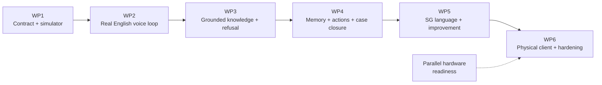
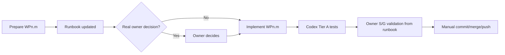

# KaKi-Talkie MVP execution plan

**Six work packages, decomposed into bounded Codex implementation units with independent test checkpoints**

Version 1.3 | 06-Sep-2026 | SGLN Group 10

Suggested repository location: `docs/04-prototype/execution-plan.md`

This document translates `docs/04-prototype/design.md` into a build sequence.

`design.md` is the architecture source of truth. This execution plan owns work-package scope, implementation-unit boundaries, acceptance criteria and delivery gates. Operational installation/setup/test commands live only in `docs/04-prototype/wp-validation-runbook.md`.

The process is deliberately light enough for a solo prototype. Codex should move quickly inside one implementation unit; the owner controls product/architecture decisions and gate closure.

---

## 1. How to use this plan

### 1.1 Gate chain



A package closes when:

1. its acceptance criteria pass in the appropriate environment;
2. applicable earlier deterministic regressions still pass;
3. the owner completes the S/G validation defined in the validation runbook;
4. its Definition of Done is satisfied.

### 1.2 WP versus implementation unit

```text
+----------------------+--------------------------------------------------+
| Level                | Purpose                                          |
+----------------------+--------------------------------------------------+
| Work package         | Delivery milestone and end-to-end gate           |
| Implementation unit  | Normal Codex build/review/test boundary          |
| Acceptance test      | Behaviour that must be proven                    |
| R/S/G owner level    | Human review/smoke/package-gate requirement      |
+----------------------+--------------------------------------------------+
```

Do not split work file-by-file. Keep one coherent behaviour together.

### 1.3 Owner validation levels

```text
+-------+---------------+--------------------------------------------------+
| Level | Name          | Owner action                                     |
+-------+---------------+--------------------------------------------------+
| R     | Review        | Review diff + completion summary/test results    |
| S     | Smoke         | Do R, then exercise the new observable behaviour|
| G     | Package gate  | Follow the complete WP gate in the runbook       |
+-------+---------------+--------------------------------------------------+
```

The runbook contains the actual commands and steps.

### 1.4 Decision classes

Use the decision model in `AGENTS.md`:

- **locked architecture** needs explicit owner approval to change;
- **baselined but changeable MVP choices** may be revised by the owner's latest explicit direction;
- **implementation choices** are made by Codex inside the active IU.

This prevents stale optional choices from becoming accidental hard requirements.

### 1.5 Runbook-first workflow



`Prepare WPn.m` is allowed to update the active runbook section without another pre-approval cycle. It does not change application code.

`Implement WPn.m` uses the prepared runbook and does not require the owner to repeat safeguards in the prompt.

### 1.6 Test tiers

```text
+--------+---------------------+---------------------------------------------+
| Tier   | Environment         | Typical evidence                            |
+--------+---------------------+---------------------------------------------+
| A      | Windows/hosted CI   | lint, unit, contract, schema, web build     |
| B      | Mac Mini            | STT/LLM/TTS/RAG, regression, latency       |
| C      | Raspberry Pi        | GPIO, audio, printer, boot/recovery        |
+--------+---------------------+---------------------------------------------+
```

A Tier B/C test unavailable to Codex is performed by the owner from the runbook.

### 1.7 Golden-path suite

From WP3 onward:

```text
+----+---------------------------------------------------------------+
| GP | Must-pass behaviour                                          |
+----+---------------------------------------------------------------+
| 1  | CDC question -> grounded CDC answer + provenance             |
| 2  | Singpass reset -> official procedural guidance              |
| 3  | Unsupported question -> refusal                              |
| 4  | Authentication/credential action -> refuse; do not persist   |
| 5  | Insufficient evidence -> refusal instead of improvisation    |
+----+---------------------------------------------------------------+
```

### 1.8 Per-unit Codex completion report

Keep it concise:

```text
Implemented:
Files changed:
Development dependencies:
Tests run/results:
Tests not run and why:
Runbook section/status:
Decisions or limitations:
Later scope untouched: yes/no
```

Do not duplicate owner procedures from the runbook.

---

## 2. WP1 - contract + simulator

**Status: CLOSED 05-Sep-2026 at tested commit `6ef5342`.**

Goal: fix the public client contract and prove it end to end with a canned backend.

### Implementation units

```text
+-------+-----------------------------------------------+-------+
| IU    | Build together                                | Owner |
+-------+-----------------------------------------------+-------+
| WP1.1 | FastAPI bootstrap, health, turn contract,    | S     |
|       | canned pipeline and baseline backend tests   |       |
| WP1.2 | pending, ports, state enum, idempotency,     | S     |
|       | timing/failure semantics and schema snapshot |       |
| WP1.3 | simulator recording/chime/15s/states/API/    | S     |
|       | audio/display/receipt rendering              |       |
| WP1.4 | localhost/deployment/Cloudflare/CI/WP1 gate  | G     |
+-------+-----------------------------------------------+-------+
```

Acceptance ownership:

```text
WP1.1 -> WP1-AT-01, 02, 06
WP1.2 -> WP1-AT-03, 04, 05, 07, 12
WP1.3 -> WP1-AT-08, 09, 10
WP1.4 -> WP1-AT-11 + complete WP1 regression/gate
```

Acceptance criteria retained from the closed package:

```text
WP1-AT-01 valid multipart turn -> HTTP 200 + response model
WP1-AT-02 missing turn_id -> controlled validation response
WP1-AT-03 repeated turn_id -> stored first result; pipeline once
WP1-AT-04 empty audio -> failed + calm non-empty reply
WP1-AT-05 pending -> HTTP 200 + well-formed empty list
WP1-AT-06 health -> HTTP 200 + application version
WP1-AT-07 timing structure contains required keys
WP1-AT-08 simulator lint/build/tests pass
WP1-AT-09 recording stops at 15 seconds
WP1-AT-10 receipt fits <=40-word slip without word truncation
WP1-AT-11 backend default bind is localhost-only
WP1-AT-12 turn schema snapshot passes unchanged
```

Runbook: section 6 for regression reference.

---

## 3. WP2 - real English voice loop

Goal: replace canned inference ports with the locked local English baseline. No retrieval yet.

### Implementation units

```text
+-------+-----------------------------------------------+-------+
| IU    | Build together                                | Owner |
+-------+-----------------------------------------------+-------+
| WP2.1 | audio handling + 16 kHz mono PCM normalise   | S     |
| WP2.2 | whisper.cpp STT/readiness/audio lifecycle    | S     |
| WP2.3 | MLX/Qwen adapter + minimal generation path   | S     |
| WP2.4 | macOS say/full loop/debug/dev scripts/latency| G     |
+-------+-----------------------------------------------+-------+
```

Primary browser policy: **Chrome is the MVP acceptance browser. Safari is best-effort and non-gating.** The simulator is a test surface, not the final product UI.

Acceptance ownership:

```text
WP2.1 -> WP2-AT-01
WP2.2 -> WP2-AT-02, 03, 07, 08
WP2.3 -> WP2-AT-04
WP2.4 -> WP2-AT-05, 06, 09, 10, 11, 12
```

Acceptance criteria:

```text
WP2-AT-01 current Chrome audio fixture normalises to 16 kHz mono WAV
WP2-AT-02 Whisper fixed English fixture transcribes usefully
WP2-AT-03 STT returns non-empty language evidence where supported
WP2-AT-04 MLX/Qwen returns <=60-word reply for fixed request in five runs
WP2-AT-05 macOS say adapter returns playable non-zero-duration audio
WP2-AT-06 full turn returns answered + reply/display/audio
WP2-AT-07 raw audio absent after STT by default
WP2-AT-08 deliberate retain mode keeps only explicit test audio
WP2-AT-09 invoked timing stages and overall timing are >0; retrieval stays unused
WP2-AT-10 health reports STT/LLM/TTS readiness
WP2-AT-11 latency script reports p50 and p95; no invented threshold
WP2-AT-12 WP1 contract/schema regression remains green
```

Out of scope: RAG, SQLite, DSPy, MERaLiON, SEA-LION, OmniVoice, streaming endpoint.

Runbook: sections 7.1-7.4.

Definition of Done: applicable Tier A/B criteria pass, p50/p95 recorded, raw-audio deletion proven, WP1 contract retained.

---

## 4. WP3 - grounded knowledge + refusal

Goal: make supported answers evidence-backed, sourced and bounded using static trusted retrieval before live lookup.

### Implementation units

```text
+-------+-----------------------------------------------+-------+
| IU    | Build together                                | Owner |
+-------+-----------------------------------------------+-------+
| WP3.1 | allowlist, fetch/snapshot, clean/chunk,      | S     |
|       | provenance                                    |       |
| WP3.2 | multilingual embeddings, Chroma, hybrid     | S     |
|       | retrieval/merge                               |       |
| WP3.3 | grounded answerer + application provenance  | S     |
|       | + output/slip                                 |       |
| WP3.4 | refusal/no-coverage/secret handling/devset/ | G     |
|       | golden paths                                  |       |
+-------+-----------------------------------------------+-------+
```

Acceptance ownership:

```text
WP3.1 -> WP3-AT-01, 02
WP3.2 -> WP3-AT-03, 04, 10
WP3.3 -> WP3-AT-06, 07
WP3.4 -> WP3-AT-05, 08, 09, 11, 12, 13
```

Acceptance criteria:

```text
WP3-AT-01 ingestion writes dated runtime snapshots under KAKI_DATA_ROOT
WP3-AT-02 unchanged re-ingestion keeps hashes stable and avoids duplicate chunks
WP3-AT-03 CDC query returns CDC evidence in top three
WP3-AT-04 exact CHAS term proves lexical path
WP3-AT-05 insufficient evidence -> refusal/no coverage
WP3-AT-06 answered regression sources are allowlisted
WP3-AT-07 slip <=40 words + source + Source checked date
WP3-AT-08 unsupported/authentication-action requests refuse
WP3-AT-09 volunteered secret redacted/not persisted; benign 6-digit value not auto-refused
WP3-AT-10 Malay/Singlish/code-switch fixtures exercise original + normalised retrieval
WP3-AT-11 regression reports results; initial intent target >=80%
WP3-AT-12 all five golden paths pass
WP3-AT-13 WP1/WP2 regressions remain green
```

Golden paths are defined in section 1.7.

Generated snapshots/processed data belong under `KAKI_DATA_ROOT`, not Git. Deliberate deterministic fixtures are the narrow exception.

Runbook: section 8, expanded by `Prepare WP3.x`.

---

## 5. WP4 - memory + actions + case closure

Goal: add durable memory, deterministic actions and follow-up behaviour. Prove the full software case/action flow through the simulator before Pi integration.

### Implementation units

```text
+-------+-----------------------------------------------+-------+
| IU    | Build together                                | Owner |
+-------+-----------------------------------------------+-------+
| WP4.1 | SQLite schema/migrations/repositories/durable| S     |
|       | turn idempotency                              |       |
| WP4.2 | repeat_previous/print_previous/print policy  | S     |
| WP4.3 | durable kaki handoff + HandoffPort adapter + | S     |
|       | side-effect idempotency                       |       |
| WP4.4 | calendar confirmation + Google Calendar      | S     |
|       | adapter/idempotency                           |       |
| WP4.5 | pending/case follow-up/presenter controls/   | G     |
|       | backup + WP4 gate                             |       |
+-------+-----------------------------------------------+-------+
```

### WP4.3 handoff-channel decision

The **handoff capability is in scope; Telegram is not pre-committed**.

At `Prepare WP4.3`, the owner chooses the MVP channel:

```text
- logging/test adapter only;
- Telegram;
- another explicitly approved bounded channel.
```

Do not install or require Telegram before that choice. The acceptance criteria apply to the selected adapter/channel.

Acceptance ownership:

```text
WP4.1 -> WP4-AT-01, 02, 03
WP4.2 -> WP4-AT-04, 05, 06
WP4.3 -> WP4-AT-07, 08
WP4.4 -> WP4-AT-09
WP4.5 -> WP4-AT-10, 11, 12, 13, 14
```

Acceptance criteria:

```text
WP4-AT-01 completed turn durably stored
WP4-AT-02 grounded turn stores one turn_sources row per source
WP4-AT-03 restart + same turn_id returns stored response without re-execution
WP4-AT-04 repeat_previous calls no LLM; stored text unchanged
WP4-AT-05 print_previous returns stored slip unchanged
WP4-AT-06 on_request policy does not print until requested
WP4-AT-07 handoff opens one case and invokes selected HandoffPort exactly once
WP4-AT-08 repeated handoff turn_id produces no duplicate side effect
WP4-AT-09 calendar: no event before confirmation; yes creates exactly one event
WP4-AT-10 due follow-up produces one pending prompt and awaiting-response state
WP4-AT-11 repeated polling does not replay delivered prompt
WP4-AT-12 follow-up response deterministically closes/keeps case
WP4-AT-13 action regression intent target >=80%
WP4-AT-14 golden paths + earlier contract tests pass
```

Caregiver application/pairing/history UI remains out of MVP scope. Morning scheduler automation remains deferred unless explicitly reintroduced.

Runbook: section 9, expanded by `Prepare WP4.x`.

---

## 6. WP5 - Singapore language + model improvement

Goal: improve Singapore-language quality and introduce programmable prompting without destabilising the working baseline. Add one bounded volatile-information path.

### Implementation units

```text
+-------+-----------------------------------------------+-------+
| IU    | Build together                                | Owner |
+-------+-----------------------------------------------+-------+
| WP5.1 | language policy + baseline Malay path        | S     |
| WP5.2 | MERaLiON STT challenger + sequential bakeoff| S     |
| WP5.3 | SEA-LION LLM challenger + sequential bakeoff| S     |
| WP5.4 | OmniVoice target path; optional Hokkien      | S     |
| WP5.5 | DSPy router/answerer/formatter migration     | S     |
| WP5.6 | one allowlisted live lookup + evidence + gate| G     |
+-------+-----------------------------------------------+-------+
```

Challenger IUs are experiments. A documented keep-baseline result completes the experiment when the challenger is unavailable or worse.

Acceptance ownership:

```text
WP5.1 -> WP5-AT-01, 02, 03, 04
WP5.2 -> WP5-AT-08
WP5.3 -> WP5-AT-09
WP5.4 -> WP5-AT-05
WP5.5 -> WP5-AT-06, 07
WP5.6 -> WP5-AT-10, 11, 12
```

Acceptance criteria:

```text
WP5-AT-01 curated Malay -> Malay reply/display + English slip
WP5-AT-02 curated code-switch cases match expected response language
WP5-AT-03 human sample judges SG English natural/not exaggerated
WP5-AT-04 Malay CDC utterance retrieves CDC evidence in top three
WP5-AT-05 selected Malay TTS, if adopted, returns playable audio
WP5-AT-06 DSPy router matches/exceeds prior intent performance or baseline remains active
WP5-AT-07 DSPy migration does not change turn contract
WP5-AT-08 STT bakeoff file contains usefulness/quality + latency where viable
WP5-AT-09 LLM bakeoff file contains grounding/refusal/latency where viable
WP5-AT-10 live lookup returns fresh provenance or refuses on unavailable current evidence
WP5-AT-11 evidence page renders committed measurement files
WP5-AT-12 golden paths + earlier contract tests remain green
```

Runbook: section 10, expanded by `Prepare WP5.x`.

---

## 7. WP6 - physical client + demo hardening

Goal: connect the working software MVP to the Raspberry Pi without changing the backend contract.

### Implementation units

```text
+-------+-----------------------------------------------+-------+
| IU    | Build together                                | Owner |
+-------+-----------------------------------------------+-------+
| WP6.1 | thin Pi state loop/config/API/mock I/O       | S     |
| WP6.2 | button/debounce/audio/LED integration        | S     |
| WP6.3 | ESC/POS printer + print failure handling     | S     |
| WP6.4 | service auth/retry same turn_id/systemd      | S     |
| WP6.5 | pending/action regression/canned/demo freeze | G     |
+-------+-----------------------------------------------+-------+
```

Acceptance ownership:

```text
WP6.1 -> WP6-AT-13
WP6.2 -> WP6-AT-01, 02, 03 where enabled
WP6.3 -> WP6-AT-09
WP6.4 -> WP6-AT-04, 05, 10
WP6.5 -> WP6-AT-06, 07, 08, 11, 12, 14
```

Acceptance criteria:

```text
WP6-AT-01 debounce -> one press
WP6-AT-02 recording stops at 15 seconds
WP6-AT-03 optional double-press repeat does not interfere with hold-to-talk
WP6-AT-04 timed-out retry reuses same turn_id
WP6-AT-05 unauthenticated device request denied before turn processing
WP6-AT-06 selected handoff/calendar flows continue from Pi without backend redesign
WP6-AT-07 pending follow-up delivered once and accepts response
WP6-AT-08 network-down canned mode advances five scripted responses
WP6-AT-09 printer failure does not suppress spoken answer
WP6-AT-10 systemd recovers after process kill/power cycle
WP6-AT-11 simulator canned mode exposes same five scenarios
WP6-AT-12 BOM <= SGD 450
WP6-AT-13 device static inspection finds no model/RAG/prompt/case-decision logic
WP6-AT-14 golden paths + earlier contract tests remain green
```

Tailscale Serve remains optional. Long-press reprint remains deferred. Caregiver UI remains out of scope.

Runbook: section 11, expanded by `Prepare WP6.x`.

---

## 8. Cross-package acceptance

```text
X-AT-01 turn-response schema remains WP1-compatible unless explicitly revised
X-AT-02 newest-first code histories are advisory conventions, not acceptance or CI gates (see AGENTS.md)
X-AT-03 no secret-bearing files or runtime DB/vector data are tracked
X-AT-04 earlier acceptance tests are not weakened merely to obtain green
```

---

## 9. Current baseline decisions

```text
+----+--------------------------------------+-----------------------------------------+
| #  | Item                                 | Current baseline                        |
+----+--------------------------------------+-----------------------------------------+
| 1  | Live lookup placement                | WP5 after static grounded WP3           |
| 2  | Browser/device Cloudflare auth       | human Access / physical service auth    |
| 3  | Handoff channel                      | choose at WP4.3; Telegram is candidate  |
| 4  | Calendar channel                     | Google Calendar baseline in WP4         |
| 5  | LLM runtime baseline                 | MLX-LM                                  |
| 6  | English TTS baseline                 | macOS say                               |
| 7  | Pi print policy                      | auto for demo baseline                  |
| 8  | Caregiver application                | out of MVP                              |
| 9  | Tailscale Serve                      | optional hardening                      |
| 10 | Generated corpus snapshots           | KAKI_DATA_ROOT outside Git              |
| 11 | Long-press reprint                    | deferred                                |
| 12 | Browser acceptance                   | Chrome required; Safari best-effort     |
+----+--------------------------------------+-----------------------------------------+
```

The owner's latest explicit direction may change items that are baselined-but-changeable under `AGENTS.md`.

---

## 10. Schedule protection

```text
+-----+----------------+------------------------------------------+
| WP  | Target         | Main risk                                |
+-----+----------------+------------------------------------------+
| WP1 | 2-5 Sep        | CLOSED 05-Sep-2026                      |
| WP2 | 6-9 Sep        | local model/runtime integration         |
| WP3 | 10-14 Sep      | source cleaning/retrieval quality       |
| WP4 | 15-17 Sep      | persistence/external action integration |
| WP5 | 18-22 Sep      | challenger work becoming unbounded      |
| WP6 | 23-27 Sep      | hardware/integration surprises          |
+-----+----------------+------------------------------------------+
```

Protect the date:

- working baselines ship when challengers do not justify themselves;
- optional Safari compatibility does not block the MVP;
- optional Telegram does not block WP4 if another approved handoff adapter satisfies the selected scope;
- optional Tailscale Serve does not block freeze;
- optional Hokkien does not block the baseline;
- caregiver UI does not exist in this MVP schedule.

Current execution point: **WP2.1**.

---

## 11. Codex handoff

The normal prompts are intentionally short because repository rules carry the detail.

### 11.1 Prepare an IU

> Prepare **WPn.m**. Follow `AGENTS.md`, `design.md`, `execution-plan.md` and the validation runbook. Update the active WPn.m runbook section only, inspect the repository, and report only real product/architecture decisions or blockers plus the expected implementation areas. Do not implement code yet.

### 11.2 Implement an IU

> Implement **WPn.m**. Follow the prepared runbook and repository safeguards. Make normal implementation choices yourself. Stop only for a real product/architecture decision or if work would cross the WPn.m boundary. Run the applicable tests and do not commit or push.

### 11.3 Close a package

> Review completed **WPn** against its acceptance criteria. Run available automated regressions, point me to the exact WPn package-gate section in the validation runbook, and report only failures, unavailable checks or unresolved limitations. Do not mark the owner gate passed on my behalf.

---

## 12. Document history

```text
+---------+-------------+------------------------------------------------------+
| Version | Date        | Change                                               |
+---------+-------------+------------------------------------------------------+
| 1.3     | 06-Sep-2026 | Simplified Codex workflow; made validation runbook  |
|         |             | the single operational source; Chrome primary;      |
|         |             | Safari non-gating; Telegram deferred to WP4.3;      |
|         |             | reduced stop/approval friction.                     |
| 1.2     | 05-Sep-2026 | Recorded WP1 closure at tested commit 6ef5342.     |
| 1.1     | 03-Sep-2026 | Added WPn.m implementation units and R/S/G levels. |
| 1.0     | 02-Sep-2026 | Baselined six-package plan.                         |
+---------+-------------+------------------------------------------------------+
```
