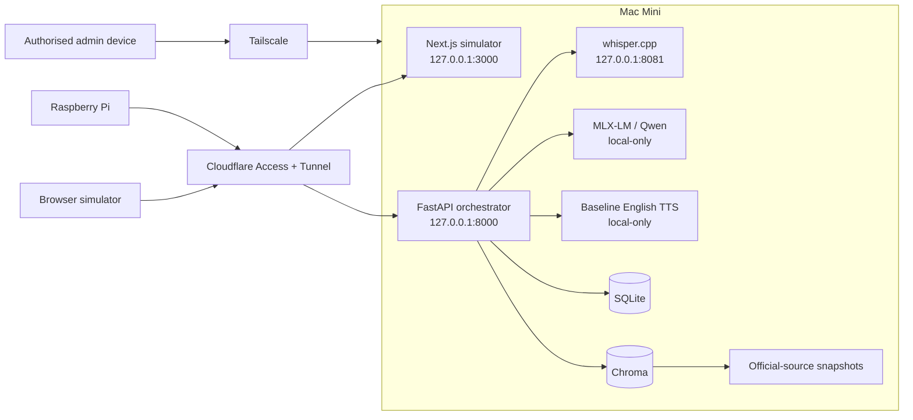
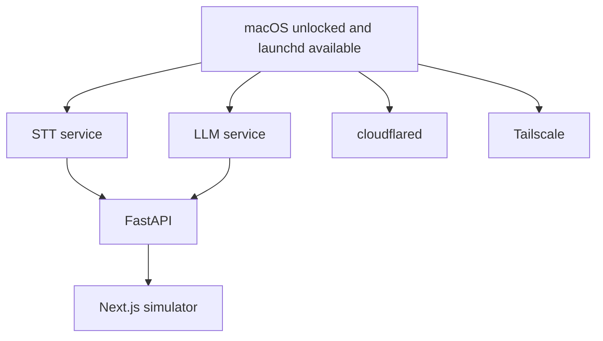
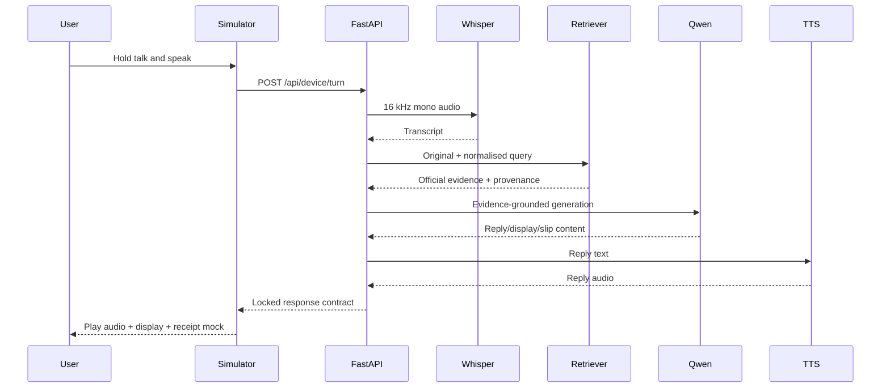

# KaKi-Talkie Mac Mini Backend Setup

**Detailed installation and operational procedure**

Version 1.0 | 01-Sep-2026 | SGLN Group 10

Suggested repository location: `infra/macos/setup.md`

This document defines how to prepare the Mac Mini that hosts the KaKi-Talkie MVP backend. It implements the locked backend design in `docs/04-prototype/design.md` and keeps the Raspberry Pi and browser simulator as thin clients of the same backend contract.

The procedure is deliberately staged. Finish and validate each stage before moving to the next one. Do not install challenger models, additional databases, container platforms, or observability stacks until the baseline vertical slice works.

---

## 1. Target state

The Mac Mini is a small dedicated AI application server.



### 1.1 Governing rules

1. The `websvc` standard account owns and runs KaKi-Talkie application files and runtime data.
2. The administrator account performs Homebrew installation, macOS configuration, LaunchDaemon installation, and other privileged changes.
3. FastAPI, model services, databases, and the simulator bind to `127.0.0.1` unless a later design explicitly says otherwise.
4. No router port-forwarding is permitted.
5. Public application traffic enters through Cloudflare Tunnel.
6. Administrative access uses Tailscale.
7. Git source, model files, runtime data, and secrets remain separate.
8. Raw audio is temporary and is deleted after transcription by default.
9. Baseline models are installed before challengers.
10. Docker and Kubernetes are not part of the MVP Mac backend.

---

## 2. Account responsibilities

Use the following split throughout this procedure.

```text
+----------------------+-------------------------------------------------------------+
| Account              | Responsibility                                              |
+----------------------+-------------------------------------------------------------+
| Administrator        | macOS settings, Homebrew, system packages, LaunchDaemons,  |
|                      | Cloudflare/Tailscale system configuration.                  |
| websvc               | Git checkout, Python environments, Node app, model files,  |
|                      | SQLite, Chroma, corpus, logs and application execution.     |
+----------------------+-------------------------------------------------------------+
```

In command examples:

```text
[ADMIN]   Run from the administrator account.
[WEBSVC]  Run from a shell logged in as websvc.
```

Do not run `brew` with `sudo`.

---

## 3. Recommended ports

Keep a fixed local port map from the start.

```text
+----------------------+-----------+----------------------+---------------------------+
| Component            | Port      | Bind                 | Exposure                  |
+----------------------+-----------+----------------------+---------------------------+
| Next.js simulator    | 3000      | 127.0.0.1            | Cloudflare only           |
| FastAPI backend      | 8000      | 127.0.0.1            | Cloudflare/Tailscale only |
| whisper.cpp server   | 8081      | 127.0.0.1            | FastAPI only              |
| LLM service          | 8082      | 127.0.0.1            | FastAPI only              |
| TTS service          | 8083      | 127.0.0.1            | FastAPI only, if needed   |
+----------------------+-----------+----------------------+---------------------------+
```

The exact LLM/TTS process implementation may change. The port reservation prevents accidental collisions while preserving the service boundaries defined in the backend design.

---

## 4. Stage 0 - macOS host preparation

### 4.1 Confirm Apple Silicon and macOS

[ADMIN]

```bash
uname -m
sw_vers
```

Expected architecture:

```text
arm64
```

Do not continue with an Intel/Rosetta shell for the AI runtimes.

Check the shell architecture before using Homebrew:

```bash
arch
command -v brew
brew --prefix
```

Expected Homebrew prefix on Apple Silicon:

```text
/opt/homebrew
```

### 4.2 Install Xcode Command Line Tools

[ADMIN]

```bash
xcode-select --install
```

If they are already installed, macOS will report that no installation is required.

Validate:

```bash
xcode-select -p
clang --version
```

### 4.3 Keep FileVault enabled

Do not disable FileVault merely to make the Mac behave more like a headless Linux server.

A cold boot after complete power loss may require someone to unlock the encrypted system volume before normal services are available. For the MVP, accept that constraint.

If unattended recovery later becomes important, use a UPS rather than weakening disk encryption.

Check FileVault in:

`System Settings -> Privacy & Security -> FileVault`

### 4.4 Enable the macOS firewall

Check:

`System Settings -> Network -> Firewall`

The firewall should be enabled.

Optional verification from Terminal:

```bash
/usr/libexec/ApplicationFirewall/socketfilterfw --getglobalstate
```

### 4.5 Configure sleep behaviour

The backend cannot serve requests while the Mac is asleep.

In:

`System Settings -> Energy`

configure the Mac so that it does not automatically sleep while acting as the backend. It is fine for an attached display to sleep.

Recommended server behaviour:

- prevent automatic system sleep when the display is off;
- allow display sleep;
- enable wake for network access where available;
- enable automatic restart after power failure if appropriate.

Optional command-line settings can be reviewed with:

```bash
pmset -g
```

Do not change power settings blindly. Record the current values before modifying them.

### 4.6 Do not enable automatic login

The `websvc` account should not automatically log into the graphical desktop. KaKi-Talkie services will later run through `launchd`.

---

## 5. Stage 1 - Homebrew and base tooling

### 5.1 Homebrew ownership model

Homebrew uses `/opt/homebrew` on Apple Silicon. Keep the existing installation if it is already working.

The account that owns the Homebrew installation should perform package installs and upgrades. The `websvc` account only needs permission to execute installed binaries.

Do not create a second Homebrew installation under `websvc`.

### 5.2 Install the baseline packages

[ADMIN]

```bash
brew update
brew install git cmake ffmpeg wget jq sqlite python@3.12 node@24
```

Why these packages exist:

```text
+------------------+-----------------------------------------------------------+
| Package          | Purpose                                                   |
+------------------+-----------------------------------------------------------+
| git              | Repository operations.                                    |
| cmake            | Build whisper.cpp.                                        |
| ffmpeg           | Normalise browser/device audio to 16 kHz mono PCM/WAV.    |
| wget             | Utility for controlled downloads where scripts need it.    |
| jq               | Inspect JSON during backend/API testing.                  |
| sqlite           | SQLite command-line diagnostics and backups.              |
| python@3.12      | Stable project Python baseline for backend/AI libraries.  |
| node@24          | Node.js 24 LTS for the Next.js simulator.                 |
+------------------+-----------------------------------------------------------+
```

### 5.3 Make Node 24 available

`node@24` is keg-only in Homebrew.

[WEBSVC]

Add the following to `~/.zprofile` if it is not already present:

```bash
export PATH="/opt/homebrew/opt/node@24/bin:/opt/homebrew/bin:/opt/homebrew/sbin:$PATH"
```

Reload:

```bash
source ~/.zprofile
```

Validate:

```bash
node --version
npm --version
python3.12 --version
ffmpeg -version | head -n 1
cmake --version
sqlite3 --version
```

Expected baseline:

- Python 3.12.x;
- Node 24.x;
- all commands resolve to native Apple Silicon/Homebrew binaries.

---

## 6. Stage 2 - `websvc` directory layout

All runtime directories belong to `websvc`.

[WEBSVC]

```bash
mkdir -p ~/projects
mkdir -p ~/kaki-talkie-data/sqlite
mkdir -p ~/kaki-talkie-data/chroma
mkdir -p ~/kaki-talkie-data/corpus/snapshots
mkdir -p ~/kaki-talkie-data/corpus/processed
mkdir -p ~/kaki-talkie-data/temp-audio
mkdir -p ~/kaki-talkie-data/backups
mkdir -p ~/kaki-talkie-data/logs
mkdir -p ~/models/whisper
mkdir -p ~/models/llm
mkdir -p ~/models/tts
mkdir -p ~/.config/kaki-talkie
```

Apply restrictive permissions to configuration and runtime data:

```bash
chmod 700 ~/.config/kaki-talkie
chmod 700 ~/kaki-talkie-data
chmod 700 ~/models
```

### 6.1 Directory responsibilities

```text
/Users/websvc/projects/kaki-talkie
    Git repository only.

/Users/websvc/kaki-talkie-data/sqlite
    SQLite database files.

/Users/websvc/kaki-talkie-data/chroma
    Chroma persistent store.

/Users/websvc/kaki-talkie-data/corpus
    Downloaded and processed allowlisted source material.

/Users/websvc/kaki-talkie-data/temp-audio
    Temporary recordings. Delete after transcription by default.

/Users/websvc/kaki-talkie-data/backups
    Local SQLite/configuration backup staging area.

/Users/websvc/kaki-talkie-data/logs
    Application/service logs where file logs are required.

/Users/websvc/models
    Downloaded model artefacts. Never commit these to Git.
```

### 6.2 Clone the repository

When the GitHub repository exists:

[WEBSVC]

```bash
cd ~/projects
git clone <KAKI_TALKIE_REPOSITORY_URL> kaki-talkie
cd kaki-talkie
git status
```

Do not place runtime databases or model caches inside this repository.

---

## 7. Stage 3 - Python environments

Do not use the macOS system Python.

Do not begin with one giant environment containing every baseline and challenger model dependency.

### 7.1 Backend environment

[WEBSVC]

```bash
python3.12 -m venv ~/.venvs/kaki-backend
source ~/.venvs/kaki-backend/bin/activate
python -m pip install --upgrade pip setuptools wheel
```

Install only the baseline backend packages needed for the first vertical slice:

```bash
python -m pip install "fastapi[standard]" pydantic-settings python-multipart httpx chromadb
```

Do not install DSPy, MERaLiON, SEA-LION or OmniVoice yet unless the corresponding implementation stage has started.

Validate:

```bash
python --version
python -c "import fastapi; print(fastapi.__version__)"
python -c "import chromadb; print(chromadb.__version__)"
```

Deactivate when finished:

```bash
deactivate
```

### 7.2 LLM environment

Create a separate Apple-Silicon MLX environment.

[WEBSVC]

```bash
python3.12 -m venv ~/.venvs/kaki-llm
source ~/.venvs/kaki-llm/bin/activate
python -m pip install --upgrade pip setuptools wheel
python -m pip install mlx mlx-lm
```

Validate:

```bash
python -c "import mlx.core as mx; print(mx.default_device())"
python -c "import mlx_lm; print('mlx-lm import OK')"
```

Expected device should be the local MLX device on Apple Silicon rather than an x86/Rosetta environment.

Deactivate:

```bash
deactivate
```

### 7.3 Later challenger environments

Create these only when the bake-off reaches them:

```text
~/.venvs/kaki-meralion
~/.venvs/kaki-omnivoice
```

Do not mix challenger dependencies into `kaki-backend` merely for convenience.

---

## 8. Stage 4 - whisper.cpp baseline STT

The locked baseline is Whisper large-v3-turbo through whisper.cpp.

### 8.1 Clone whisper.cpp outside the KaKi-Talkie repository

[WEBSVC]

```bash
mkdir -p ~/src
cd ~/src
git clone https://github.com/ggml-org/whisper.cpp.git
cd whisper.cpp
```

### 8.2 Build natively on Apple Silicon

[WEBSVC]

```bash
cmake -B build
cmake --build build -j --config Release
```

The normal Apple Silicon build uses Metal acceleration.

Validate binaries:

```bash
ls -l build/bin/whisper-cli
ls -l build/bin/whisper-server
```

### 8.3 Download the baseline model

Use the model-download mechanism provided by the checked-out whisper.cpp version.

First inspect available model names:

```bash
./models/download-ggml-model.sh
```

Download the large-v3-turbo model using the exact model identifier supported by that version of whisper.cpp.

After download, copy or move the final model file to:

```text
/Users/websvc/models/whisper/
```

Do not download additional Whisper models until there is a measured reason to compare them.

### 8.4 Create a known-good audio fixture

Use FFmpeg to ensure the expected input format:

```bash
ffmpeg -i <INPUT_AUDIO> -ar 16000 -ac 1 -c:a pcm_s16le /tmp/kaki-stt-test.wav
```

Then test transcription:

```bash
~/src/whisper.cpp/build/bin/whisper-cli \
  -m ~/models/whisper/<WHISPER_MODEL_FILE> \
  -f /tmp/kaki-stt-test.wav
```

Acceptance criteria:

- transcription completes without an error;
- Apple Silicon acceleration is reported by the runtime;
- normal Singapore English speech is recognisable enough for the vertical slice;
- the model stays entirely local.

### 8.5 Run whisper.cpp as a localhost service

For the service boundary, use whisper.cpp's HTTP server and bind it to localhost only.

Example:

```bash
~/src/whisper.cpp/build/bin/whisper-server \
  --host 127.0.0.1 \
  --port 8081 \
  -m ~/models/whisper/ggml-large-v3-turbo.bin
```

In another terminal, submit a test file using the endpoint exposed by the version you built.

The service must never listen on `0.0.0.0` for the MVP.

### 8.6 STT acceptance gate

Do not proceed to model bake-offs until all of these are true:

```text
[ ] whisper.cpp builds natively.
[ ] baseline model loads.
[ ] 16 kHz mono WAV transcribes.
[ ] HTTP STT service listens on 127.0.0.1:8081 only.
[ ] FastAPI will be able to reach the STT service locally.
```

---

## 9. Stage 5 - baseline local LLM with MLX-LM

The baseline is a small 4 bit quantised 8B Qwen-class instruct model.
Python version : 3.12.14
MLX_LM ver: 0.31.3

### 9.1 Select the model conservatively

Use a current MLX-compatible quantised Qwen instruct checkpoint that satisfies the backend design.

Do not select a model merely because it is the largest that fits in 48 GB unified memory.

The first model needs to prove:

- bounded intent interpretation;
- retrieval-grounded synthesis;
- concise output;
- acceptable Singapore English;
- useful Malay behaviour;
- low enough latency for the interaction loop.

### 9.2 Test MLX-LM interactively

[WEBSVC]

```bash
source ~/.venvs/kaki-llm/bin/activate
mlx_lm.generate --model mlx-community/Qwen3-8B-4bit --prompt "Reply with only: KaKi-Talkie LLM OK"
```

Confirm the model loads and returns a response.

### 9.3 Model cache location

Model tools may use a Hugging Face cache by default. To keep disk usage understandable, set a dedicated cache location before downloading large model files.

For example, add to the `websvc` environment used for KaKi-Talkie:

```bash
export HF_HOME="/Users/websvc/models/huggingface"
```

Create it:

```bash
mkdir -p ~/models/huggingface
chmod 700 ~/models/huggingface
```

Do not commit model artefacts.

### 9.4 Local LLM service boundary

MLX-LM provides a local HTTP server. For the MVP it may be used as a localhost-only inference adapter while the architecture is still evolving.

Keep it bound to localhost and reserve port `8082`.

The MLX-LM server is not the public application API and must never be exposed through Cloudflare directly.

If the project's own `services/llm/` adapter later replaces the generic MLX-LM server, keep the same logical port/interface boundary so FastAPI remains unchanged.

### 9.5 LLM acceptance gate

```text
[ ] MLX imports natively on Apple Silicon.
[ ] Qwen baseline model loads.
[ ] Simple generation works.
[ ] Repeated generations do not reload the model every turn.
[ ] LLM endpoint/process is local-only.
[ ] Disk location of downloaded model files is known.
```

---

## 10. Stage 6 - baseline English TTS

Do not block the vertical slice on multilingual TTS.

The first goal is simply:

```text
text -> local audio file -> browser/device playback
```

### 10.1 Use macOS speech as the initial adapter

macOS includes the `say` command, which is adequate to prove the backend contract before OmniVoice is integrated.

[WEBSVC]

```bash
say -o /tmp/kaki-tts-test.aiff "KaKi-Talkie text to speech is working."
```

Convert to a browser-friendly format if required:

```bash
ffmpeg -y -i /tmp/kaki-tts-test.aiff /tmp/kaki-tts-test.wav
```

Play locally for verification:

```bash
afplay /tmp/kaki-tts-test.wav
```

Acceptance criteria:

- audio file is created;
- speech is understandable;
- the process is fully local;
- FastAPI can invoke the adapter without requiring a GUI session.

### 10.2 Later multilingual TTS

Only after the English vertical slice works should the team create the target TTS environments and evaluate:

- OmniVoice family for English/Malay;
- MERaLiON OmniVoice Hokkien where practical.

Native-speaker review remains required before claiming Hokkien demo quality.

---

## 11. Stage 7 - FastAPI backend runtime

### 11.1 Application environment

[WEBSVC]

```bash
source ~/.venvs/kaki-backend/bin/activate
cd ~/projects/kaki-talkie/backend
```

For development, run the project using the command defined by the repository once `backend/src/kaki_backend/main.py` exists.

The production-style local service must bind to:

```text
127.0.0.1:8000
```

Never use `0.0.0.0` merely to make local testing easier.

### 11.2 First endpoint

The first backend endpoint should be:

```text
GET /api/health
```

It should become healthy before STT, LLM, RAG or TTS are added.

Local validation:

```bash
curl -s http://127.0.0.1:8000/api/health | jq
```

### 11.3 Baseline turn endpoint

Before real inference, make `POST /api/device/turn` return the locked response contract using canned values.

The purpose of this stage is to prove:

- multipart upload;
- `device_id`;
- `session_id`;
- mandatory `turn_id`;
- well-formed JSON on success and failure;
- idempotent handling of retried `turn_id` values.

Do not combine this with RAG or action implementation yet.

### 11.4 Runtime configuration file

Create a local configuration file outside Git:

```text
/Users/websvc/.config/kaki-talkie/backend.env
```

Restrict it:

```bash
chmod 600 ~/.config/kaki-talkie/backend.env
```

It should eventually hold deployment-specific values such as:

```text
KAKI_ENV
KAKI_DATA_ROOT
KAKI_SQLITE_PATH
KAKI_CHROMA_PATH
KAKI_TEMP_AUDIO_PATH
KAKI_STT_URL
KAKI_LLM_URL
KAKI_TTS_URL
KAKI_LOG_LEVEL
```

Secrets such as Cloudflare service credentials, future Telegram credentials, or calendar credentials must never appear in Git.

`.env.example` contains variable names only.

### 11.5 FastAPI acceptance gate

```text
[ ] /api/health works on localhost.
[ ] /api/device/turn accepts the locked multipart contract.
[ ] duplicate turn_id does not repeat a side effect.
[ ] every failure path returns JSON.
[ ] backend listens only on 127.0.0.1:8000.
[ ] configuration/secrets are outside Git.
```

---

## 12. Stage 8 - SQLite persistence

SQLite is the system of record for MVP application state.

Database location:

```text
/Users/websvc/kaki-talkie-data/sqlite/kaki-talkie.db
```

### 12.1 Logical tables

The implementation should create the schema through the repository's migration mechanism rather than manual SQL typed on the server.

Expected logical ownership:

```text
devices
sessions
turns
turn_sources
cases
```

### 12.2 Inspect the database

[WEBSVC]

```bash
sqlite3 ~/kaki-talkie-data/sqlite/kaki-talkie.db ".tables"
```

### 12.3 SQLite permissions

```bash
chmod 600 ~/kaki-talkie-data/sqlite/kaki-talkie.db
```

The containing directory is already restricted to `websvc`.

### 12.4 Backup procedure

Use SQLite's backup mechanism rather than copying a database file during an active write.

Example manual backup:

```bash
sqlite3 ~/kaki-talkie-data/sqlite/kaki-talkie.db \
  ".backup '/Users/websvc/kaki-talkie-data/backups/kaki-talkie.db.backup'"
```

Automate this later through `scripts/backup_sqlite.sh` or `launchd` only after the database is in use.

---

## 13. Stage 9 - Chroma and corpus storage

Chroma may run embedded in the backend process for the MVP. A separate Chroma server is not required merely to satisfy the architecture.

Persistent Chroma location:

```text
/Users/websvc/kaki-talkie-data/chroma
```

### 13.1 Corpus split

Keep allowlist configuration in Git:

```text
rag/corpus/allowlist.yaml
```

Keep captured source content outside Git:

```text
/Users/websvc/kaki-talkie-data/corpus/snapshots
/Users/websvc/kaki-talkie-data/corpus/processed
```

### 13.2 Minimum provenance

Each stored chunk should preserve:

```text
source_url
page_title
scheme
captured_at
source_updated_at
content_hash
freshness_class
valid_until
```

### 13.3 Start small

Initial ingestion should contain only five to ten official pages needed to prove the vertical slice.

Do not ingest the full planned allowlist merely because the storage is ready.

Recommended first topics:

- Singpass reset guidance;
- CDC Voucher guidance;
- one CHAS/health-support information page;
- one LifeSG/ServiceSG information page;
- one deliberately unsupported question for refusal testing.

### 13.4 Retrieval acceptance gate

```text
[ ] source snapshots are dated.
[ ] clean text/markdown is used for retrieval, not print-to-PDF text alone.
[ ] Chroma survives backend restart.
[ ] every retrieved chunk has provenance metadata.
[ ] answer source URLs/dates come from application metadata, not the LLM.
```

---

## 14. Stage 10 - Next.js simulator

The simulator is a client of the same backend contract as the Raspberry Pi.

### 14.1 Node runtime

[WEBSVC]

```bash
node --version
npm --version
```

Expected Node major version:

```text
24
```

### 14.2 Install dependencies

Once `apps/web/package.json` exists:

```bash
cd ~/projects/kaki-talkie/apps/web
npm ci
```

Use `npm install` only when intentionally changing dependency resolution and updating the lock file.

### 14.3 Local development run

Run the simulator on localhost only:

```text
127.0.0.1:3000
```

The simulator should call the FastAPI contract rather than implementing orchestration itself.

### 14.4 Browser microphone

The simulator must eventually test:

- explicit talk control;
- 15-second recording cap;
- upload to `/api/device/turn`;
- listening/thinking/speaking/printing states;
- `reply_audio` playback;
- `display_text` rendering;
- English 58 mm slip rendering.

### 14.5 Simulator acceptance gate

```text
[ ] simulator loads locally.
[ ] microphone permission is requested only when the user activates talk.
[ ] recorded audio reaches the FastAPI endpoint.
[ ] the same response contract intended for the Pi is rendered.
[ ] no model/RAG/business logic has migrated into the web app.
```

---

## 15. Stage 11 - Cloudflare Tunnel

Cloudflare Tunnel is the only public ingress path.

The existing Cloudflare installation should be reused rather than replaced simply for KaKi-Talkie.

### 15.1 Verify cloudflared

[ADMIN]

```bash
cloudflared --version
```

If it is already installed and running as a service, do not reinstall it.

Cloudflare supports running `cloudflared` as a macOS service at boot. A boot-level service is preferred for this backend.

### 15.2 Target hostname

Public application hostname:

```text
talkie.lookieman.dev
```

Initial route during backend-only testing can point to:

```text
http://localhost:8000
```

Once the simulator is added, preserve the final public URL design:

```text
https://talkie.lookieman.dev/sim
https://talkie.lookieman.dev/api/device/turn
https://talkie.lookieman.dev/api/device/pending
```

Cloudflare Tunnel ingress rules can match by hostname and path. Use path-specific routing when the simulator and API need different local origins.

Example logical routing:

```text
+--------------------------------------+----------------------------+
| Public route                         | Local origin               |
+--------------------------------------+----------------------------+
| talkie.lookieman.dev/api/device/*    | http://127.0.0.1:8000      |
| talkie.lookieman.dev/api/health      | http://127.0.0.1:8000      |
| talkie.lookieman.dev/*               | http://127.0.0.1:3000      |
+--------------------------------------+----------------------------+
```

If the existing tunnel is dashboard-managed, configure the published application routes there rather than converting it unnecessarily to a locally-managed tunnel.

### 15.3 Cloudflare Access - human routes

Protect human-facing routes such as:

```text
/sim
/test
/admin
```

Use Cloudflare Access human authentication.

For the MVP, allow only explicitly authorised users rather than making the simulator publicly available.

### 15.4 Cloudflare Access - device routes

Protect:

```text
/api/device/*
```

with machine/service authentication plus the application's own per-device identity/token where implemented.

The device credential is separate from the Cloudflare service credential.

Unauthenticated device requests should be rejected before model inference.

### 15.5 Never publish model services

Do not create Cloudflare routes for:

```text
127.0.0.1:8081
127.0.0.1:8082
127.0.0.1:8083
SQLite
Chroma
```

Only the application surfaces are externally reachable.

### 15.6 Cloudflare validation

From a device not on the home LAN:

```text
[ ] talkie.lookieman.dev resolves.
[ ] human route requires Access authentication.
[ ] unauthenticated /api/device request is denied.
[ ] authorised simulator can reach FastAPI.
[ ] no router port-forwarding exists.
[ ] local API/model ports are not directly reachable from the Internet.
```

---

## 16. Stage 12 - Tailscale administration

Tailscale is the management/private network, not the public application ingress.

### 16.1 Verify installation

Use the already-installed Tailscale client.

Confirm the Mac Mini is connected to the intended tailnet.

The macOS VPN configuration should remain enabled; it is required for Tailscale networking.

### 16.2 Administrative use

Use Tailscale from authorised development machines for:

- SSH to the Mac Mini;
- diagnostics;
- private service testing;
- optional Raspberry Pi fallback connectivity.

Do not expose the public simulator through Tailscale Funnel.

### 16.3 Optional Tailscale Serve fallback

If a private HTTPS proxy is useful later, Tailscale Serve may forward a tailnet URL to the localhost FastAPI service.

This is optional and should be added only after the main Cloudflare path works.

Keep normal Tailscale ACLs restrictive.

---

## 17. Stage 13 - `launchd` automatic startup

Do this only after each component works manually.

The Mac should not require a Terminal window to remain open.

### 17.1 Service strategy

Use system LaunchDaemons installed under:

```text
/Library/LaunchDaemons/
```

Run KaKi-Talkie application processes as the `websvc` user by setting the service user in the LaunchDaemon configuration.

Recommended service names:

```text
dev.lookieman.kaki-stt
dev.lookieman.kaki-llm
dev.lookieman.kaki-api
dev.lookieman.kaki-web
```

TTS does not require a persistent daemon while the baseline uses macOS `say`.

### 17.2 Startup order

Logical dependency order:



Do not assume launchd guarantees model readiness merely because a process has started. The FastAPI health/readiness endpoint should distinguish between:

- process alive;
- STT ready;
- LLM ready;
- database ready;
- full backend ready.

### 17.3 Secrets and LaunchDaemons

Do not put secret values directly into a committed plist.

Keep the environment file at:

```text
/Users/websvc/.config/kaki-talkie/backend.env
```

with mode `600`.

A launch configuration may start a shell that loads this file and then `exec`s the application process. Any helper shell script created in the repository must follow the project's code-file change-log convention.

### 17.4 Logging

Use macOS unified logging or explicit stdout/stderr files under:

```text
/Users/websvc/kaki-talkie-data/logs
```

Do not log:

- passwords;
- OTPs;
- Cloudflare tokens;
- device secrets;
- raw audio by default.

### 17.5 Reboot test

After LaunchDaemons exist and have been validated individually:

1. stop all manually-started KaKi-Talkie processes;
2. reboot the Mac normally;
3. unlock FileVault if required;
4. do not open development terminals;
5. verify the services become healthy;
6. verify Cloudflare reaches the simulator/API;
7. verify Tailscale administrative access.

Acceptance target:

```text
normal reboot + volume unlock -> KaKi-Talkie returns automatically
```

---

## 18. Stage 14 - logging and metrics

Instrument from the first real turn.

Each turn should record at least:

```text
turn_id
timestamp
device_id
session_id
STT latency
routing latency
retrieval/live lookup latency
LLM latency
TTS latency
overall latency
intent
response language
state
source/provenance identifiers
```

Do not install Prometheus, Grafana, Elasticsearch, or another observability platform for the MVP.

Structured application logs plus SQLite are sufficient until a real operational need appears.

### 18.1 Latency measures

Record:

- p50 end-to-end latency;
- p95 end-to-end latency;
- eventually time to first audio.

The design target is approximately five seconds to first useful response, with an eight-second failure boundary where practical. Treat those as hypotheses until measured on the actual stack.

---

## 19. Stage 15 - raw audio handling

Raw audio is deleted after transcription by default.

Temporary location:

```text
/Users/websvc/kaki-talkie-data/temp-audio
```

Requirements:

1. create a unique temporary file per turn;
2. normalise it to the STT input format;
3. transcribe;
4. store only the transcript/metadata needed by the MVP;
5. delete the raw and normalised audio files in both success and failure paths.

Test-session recordings may be retained only when the team has explicitly decided to retain consent-cleared audio for the STT bake-off.

Do not mix retained test samples with ordinary runtime audio.

---

## 20. Stage 16 - backups

Back up what is expensive to recreate, not what is merely large.

### 20.1 Back up

- SQLite database;
- application configuration excluding secrets where appropriate;
- corpus snapshots;
- consent-cleared evaluation/test artefacts;
- important local operational notes not already in Git.

### 20.2 Do not back up routinely

- Whisper model downloads;
- Qwen/SEA-LION model downloads;
- package caches;
- build directories;
- `node_modules`;
- Python virtual environments.

Those can be recreated from repositories and dependency definitions.

### 20.3 Restore test

A backup is not useful until restoration has been tested.

Before pitch freeze, test restoring SQLite and the corpus into a clean temporary directory and verify the backend can read them.

---

## 21. Stage 17 - disk management

The Mac Mini has finite internal storage and local AI models can consume it quickly.

Inspect regularly:

```bash
df -h /
du -sh ~/models/* 2>/dev/null
du -sh ~/kaki-talkie-data/* 2>/dev/null
```

Rules:

1. keep only baseline models until bake-off;
2. remove failed/abandoned model downloads;
3. understand where Hugging Face caches are stored;
4. do not let retained audio accumulate silently;
5. do not store large demo videos/photo sets in Git;
6. preserve comfortable free SSD space for macOS swap and model loading.

---

## 22. Stage 18 - security verification

Before allowing the Raspberry Pi or external simulator to use the backend, verify all of the following.

```text
[ ] FileVault remains enabled.
[ ] macOS firewall remains enabled.
[ ] no router port-forward exists for KaKi-Talkie.
[ ] FastAPI binds to 127.0.0.1 only.
[ ] whisper.cpp binds to 127.0.0.1 only.
[ ] LLM service binds to 127.0.0.1 only.
[ ] simulator binds to 127.0.0.1 only.
[ ] Cloudflare is the public ingress path.
[ ] human simulator/test routes use Cloudflare Access.
[ ] device API routes use service/machine authentication.
[ ] model services are not published.
[ ] secrets are outside Git and have restrictive permissions.
[ ] raw audio is deleted by default.
[ ] application never asks for Singpass passwords, OTPs or credentials.
[ ] Tailscale is restricted to authorised administrative devices/users.
```

---

## 23. Stage 19 - end-to-end baseline acceptance test

The Mac setup is complete when this works without the Raspberry Pi.

### Test question

Use a supported question such as:

```text
How do I reset my Singpass password?
```

### Expected flow



### Acceptance checklist

```text
[ ] Open protected https://talkie.lookieman.dev/sim.
[ ] Authenticate through Cloudflare Access.
[ ] Hold the simulated talk control.
[ ] Speak the question.
[ ] Recording stops by release or the 15-second cap.
[ ] FastAPI accepts the turn with a unique turn_id.
[ ] Whisper returns a useful transcript.
[ ] Retrieval returns allowlisted official evidence.
[ ] Source metadata is application-derived.
[ ] Qwen produces a concise grounded answer.
[ ] English TTS produces playable audio.
[ ] display_text is rendered.
[ ] English slip_text is rendered as a receipt.
[ ] the raw recording is deleted after transcription.
[ ] timings are recorded.
[ ] repeating the same turn_id does not repeat a side effect.
```

After this succeeds, the physical Raspberry Pi becomes another client of the same API rather than a prerequisite for proving the backend.

---

## 24. What not to install yet

Do not add these during initial Mac preparation:

```text
Docker Desktop
Kubernetes
Redis
PostgreSQL
Elasticsearch/OpenSearch
Kafka or another message queue
Prometheus/Grafana
MERaLiON-3
SEA-LION 27B
OmniVoice/Hokkien TTS
reranking service
cloud LLM fallback
caregiver application dependencies
Google Calendar integration
Telegram integration
open-web autonomous browsing
```

Add a component only when a locked requirement or measured limitation requires it.

---

## 25. Recommended implementation sequence after host setup

```text
+---------+------------------------------------------------------------------+
| Step    | Deliverable                                                      |
+---------+------------------------------------------------------------------+
| 1       | FastAPI /api/health and canned /api/device/turn.                 |
| 2       | Simulator records and sends audio, renders canned response.      |
| 3       | whisper.cpp replaces canned transcript.                          |
| 4       | Qwen + English TTS close the ungrounded local voice loop.        |
| 5       | SQLite persists turns/sessions and turn_id idempotency.          |
| 6       | 5-10 official pages + Chroma/hybrid retrieval ground answers.    |
| 7       | Refusal, repeat and print-previous flows.                         |
| 8       | Cloudflare human/device policies hardened.                       |
| 9       | launchd starts healthy services automatically.                   |
| 10      | Malay path and small regression set.                             |
| 11      | MERaLiON and SEA-LION bake-offs only if baseline limitations     |
|         | justify them.                                                    |
+---------+------------------------------------------------------------------+
```

---

## 26. Maintenance routine

### Before development sessions

```bash
df -h /
curl -s http://127.0.0.1:8000/api/health | jq
```

Check Cloudflare and Tailscale only if remote/public access is required for that session.

### Weekly during MVP development

1. inspect free disk space;
2. review failed turns and latency outliers;
3. back up SQLite;
4. refresh the selected corpus sources when scheduled;
5. review model/cache growth;
6. add real failures to the regression set;
7. apply dependency upgrades intentionally, not automatically immediately before a demo.

### Before pitch freeze

1. freeze dependencies/lock files;
2. take a fresh SQLite/corpus backup;
3. verify LaunchDaemons after reboot;
4. rehearse through Cloudflare rather than only localhost;
5. rehearse with network failure;
6. rehearse canned mode on the Pi;
7. keep challenger model changes out unless already validated;
8. record p50/p95 latency and lightweight quality evidence.

---

## 27. Troubleshooting order

When the full system fails, debug from the inside out rather than starting at Cloudflare.

```text
1. Mac awake and unlocked?
2. Local disk space healthy?
3. STT process healthy on 127.0.0.1:8081?
4. LLM process healthy/local model loaded?
5. FastAPI /api/health healthy on 127.0.0.1:8000?
6. Simulator healthy on 127.0.0.1:3000?
7. SQLite/Chroma readable?
8. Cloudflare Tunnel connected?
9. Cloudflare Access policy allowing expected user/device?
10. Tailscale relevant only for admin/private path?
```

This order prevents an edge-network problem from being confused with a dead model process, and vice versa.

---

## 28. External references checked for this setup

These references were checked on 01-Sep-2026 to confirm current installation behaviour. They are implementation references; the KaKi-Talkie design document remains authoritative for project decisions.

- Homebrew installation: https://docs.brew.sh/Installation
- Homebrew Node 24 formula: https://formulae.brew.sh/formula/node@24
- Homebrew Python 3.12 formula: https://formulae.brew.sh/formula/python@3.12
- whisper.cpp: https://github.com/ggml-org/whisper.cpp
- whisper.cpp server: https://github.com/ggml-org/whisper.cpp/tree/master/examples/server
- MLX-LM: https://github.com/ml-explore/mlx-lm
- FastAPI: https://fastapi.tiangolo.com/
- Cloudflare Tunnel routing: https://developers.cloudflare.com/tunnel/routing/
- Cloudflare Tunnel macOS service: https://developers.cloudflare.com/tunnel/advanced/local-management/as-a-service/macos/
- Cloudflare Access application paths: https://developers.cloudflare.com/cloudflare-one/access-controls/policies/app-paths/
- Tailscale macOS installation: https://tailscale.com/docs/install/mac
- Tailscale Serve: https://tailscale.com/docs/features/tailscale-serve

---

## 29. Document history

```text
+---------+-------------+-----------------------------------------------------------+
| Version | Date        | Change                                                    |
+---------+-------------+-----------------------------------------------------------+
| 1.0     | 01-Sep-2026 | First detailed Mac Mini backend installation procedure.   |
|         |             | Implements the locked simulator-first backend design,     |
|         |             | websvc/admin separation, native Apple Silicon inference,  |
|         |             | localhost-only services, Cloudflare public ingress and     |
|         |             | Tailscale administration.                                  |
+---------+-------------+-----------------------------------------------------------+
```
